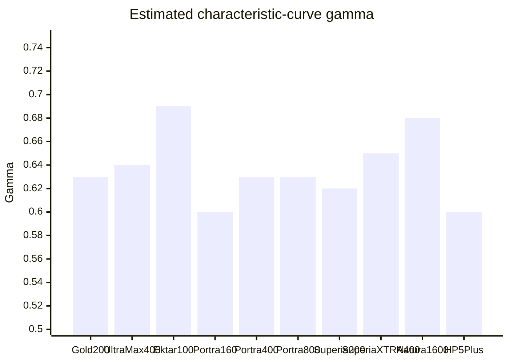
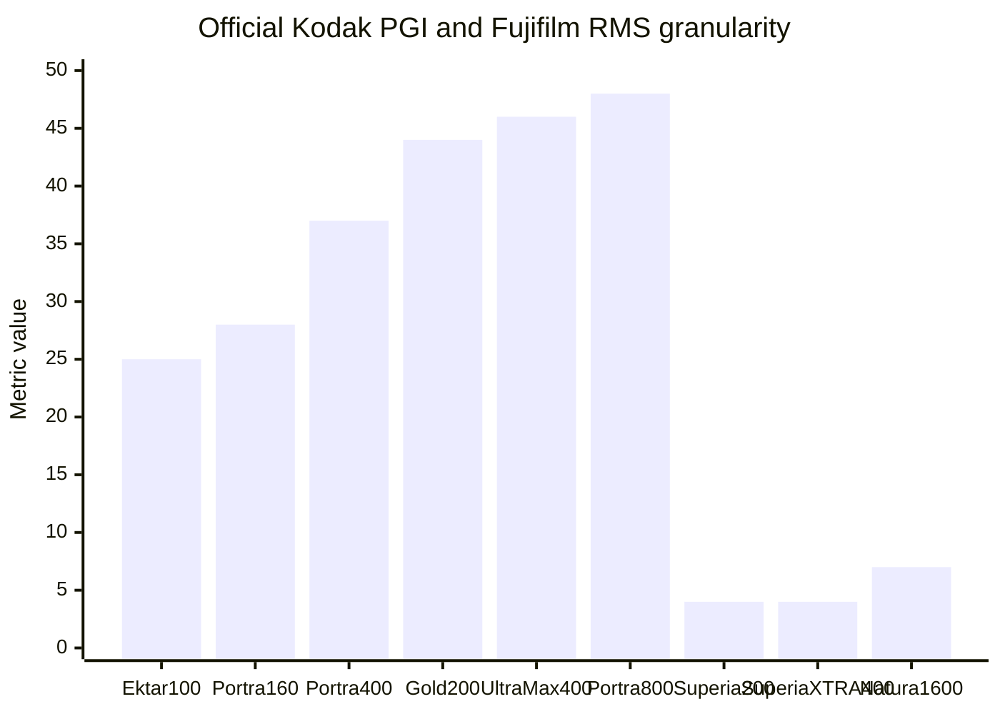
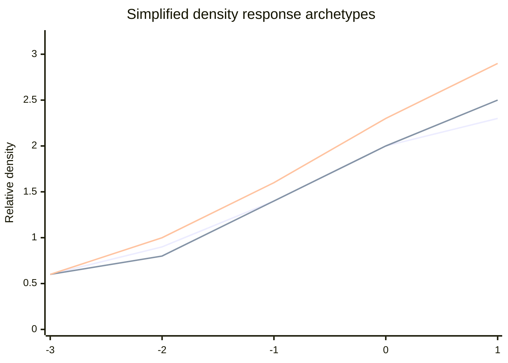

# Film Stock Characteristics for Building Digital Film Presets

## Executive summary

For digital preset creation, the most important differences among the requested stocks are not just color palette, but the combination of characteristic-curve shape, exposure latitude, scanner behavior, and grain metric. The cleanest high-saturation profile in this set is Kodak Ektar 100, with the finest official Kodak grain metric in current publications and the strongest saturation placement in Kodak’s own comparison brochure. Kodak Portra 400 and 800 stand apart for unusually long useful exposure ranges in their published characteristic curves, which reputable secondary analyses place at roughly 12 and 12.5 stops respectively; Portra 160 is gentler and more exposure-sensitive, despite very fine grain. Kodak Gold 200 and UltraMax 400 are more contrasty and less forgiving than the Portra family, with visibly higher Kodak Print Grain Index values. Fujifilm’s legacy SUPERIA 200 and SUPERIA X-TRA 400 are unusually fine-grained for consumer films by Fujifilm’s RMS metric, with 50/125 lines/mm resolving-power figures in the official guide. Natura 1600 is best treated as a close proxy to FUJICOLOR SUPERIA 1600 [CU] because the official Natura datasheet is hard to locate publicly; that proxy gives ISO 1600, RMS 7, 50/125 lines/mm, and explicit long-exposure corrections. Ilford HP5 Plus is the most flexible pushable B&W stock in this set, with Ilford officially recommending usable meter settings up to EI 3200 and a reciprocity formula of \(T_a=T_m^{1.31}\). HARMAN Phoenix II is definitively a C-41 color negative film, not a paper product; unlike mainstream color negatives, it has narrower latitude, no orange mask, and official Fuji SP-3000 scanner-channel guidance from Harman itself. citeturn9view2turn9view4turn9view5turn14view0turn14view1turn12view10turn21view0turn30view3turn11view0turn36view1turn40search1turn40search2turn40search4turn40search8

If the goal is a practical preset family rather than a museum-grade spectral model, the best implementation strategy is to separate the problem into three layers: a stock-level tone map derived from the sensitometric curves, a palette layer derived from official/secondary color descriptions, and a scanner layer derived from Frontier defaults. Fuji Frontier “Master 0” defaults are built around **Standard** tone adjustment, **Hypertone off**, **Full Correction on**, typical C/M/Y key-step widths of **8**, density widths of **15**, and BL/SL values of **0**. That means many “Frontier-looking” scans already add an S-curve and color-density correction before any creative grading. For Phoenix II, Harman explicitly recommends a custom SP-3000 channel with **Tone adjustment = All Hard**, **Saturation = +2**, and color balance starting points **C=-2, M=0, Y=0**, which is unusually concrete compared with most film manufacturers’ scanning guidance. citeturn33view0turn11view0

## Method and assumptions

This report prioritizes official Kodak, Fujifilm, Ilford, Harman, and Frontier documentation, then uses secondary sources only where the manufacturers do not provide a directly usable value. Three classes of values appear in the tables:

**Specified** values come directly from technical sheets, manuals, or official specs.  
**Estimated** values are read from the published characteristic curves or spectral-density plots when manufacturers publish the graph but not the scalar.  
**Inferred preset values** are starting points for digital emulation, derived from the official curve shape, grain metric, color description, and Frontier behavior; those are useful for presets, but they are not manufacturer specs. citeturn37view0turn37view1turn37view2turn37view3turn37view4turn37view5turn37view6turn37view7turn37view8turn33view0

Several requested fields are not published consistently across brands. Kodak’s current color-negative datasheets generally provide **Print Grain Index** and **MTF curves**, not an explicit RMS granularity value or a two-number resolving-power pair in lines/mm. Fujifilm’s legacy consumer datasheets are more generous, often providing **Diffuse RMS Granularity** and **Resolving Power** at both **1.6:1** and **1000:1** chart contrast. Ilford’s HP5+ technical sheet provides push guidance, development times, a characteristic curve, and reciprocity, but not a current official RMS or lines/mm spec. Where a numeric field is missing and no reliable substitute exists, I mark it **unspecified**. citeturn14view0turn14view1turn14view2turn14view3turn14view4turn12view10turn21view0turn30view3

For the Fujifilm consumer films, I interpreted your request as the legacy products **FUJICOLOR SUPERIA 200 [CA]** and **FUJICOLOR SUPERIA X-TRA 400 [CH]**, not the newer **FUJIFILM 200** rebadge. I note the newer Fujifilm 200 separately in the sources only to avoid variant confusion. For **Fuji Natura 1600**, I use **FUJICOLOR SUPERIA 1600 [CU]** as the closest official proxy, with the caveat that public community sources debate whether Natura 1600 is identical or merely very close to Superia 1600. For **Harman Phoenix II**, the ambiguity in your prompt is now resolved by Harman’s own 2025 data: Phoenix II is a **35mm/120 C-41 color negative film**. citeturn25view0turn46view0turn9view7turn20view0turn41search2turn11view0

I normalize **saturation index** to a neutral reference of **100**, roughly corresponding to a restrained portrait-oriented color-negative baseline similar to Portra 160. This is a preset-design convenience, not an industry standard. I also express **color balance/tint** as both a **Kelvin bias** and a **small RGB gain suggestion** relative to a neutral daylight conversion, because those are directly useful in RAW preset design. Frontier tone-curve points are given as 8-bit control points `[input, output]` on the master luminance curve, again as practical preset starts rather than claims about the scanner’s internal LUT. These inferred values are grounded in the official film curves plus Frontier defaults and are labeled as such in the tables. citeturn36view1turn33view0turn32search2turn32search21turn32search22

## Cross-film comparison

The table below consolidates the most useful preset-building numbers: nominal speed, practical exposure index, estimated contrast slope, latitude, color tendency, grain metric, and scan-oriented preset direction.

| Film stock | Exact variant used | Base ISO | Practical EI range | Curve gamma | Latitude | Color bias | Saturation index | Grain metric | Resolving power | Reciprocity |
|---|---|---:|---:|---:|---:|---|---:|---|---|---|
| Kodak Gold 200 | KODAK GOLD 200 | 200 | 100–200 | ≈0.63† | ≈8 stops | warm yellow/red | 112 | PGI 44 | unspecified | none to 1 s; longer unlisted |
| Kodak UltraMax 400 | KODAK ULTRA MAX 400 | 400 | 200–400 | ≈0.64† | ≈8 stops | warm neutral | 110 | PGI 46 | unspecified | none to 1 s; >1 s may need tests |
| Kodak Ektar 100 | KODAK PROFESSIONAL EKTAR 100 | 100 | 80–100 | ≈0.69† | ≈9 stops | slightly cool / magenta-leaning vivid reds | 125 | PGI <25 | unspecified | none to 1 s; longer: test |
| Kodak Portra 160 | KODAK PROFESSIONAL PORTRA 160 | 160 | 100–160 | ≈0.60† | ≈7 stops | warm-neutral skin tones | 100 | PGI 28 | unspecified | none to 1 s; longer: test |
| Kodak Portra 400 | KODAK PROFESSIONAL PORTRA 400 | 400 | 250–400 | ≈0.63† | ≈12 stops | neutral-warm | 103 | PGI 37 | unspecified | none to 1 s; longer: test |
| Kodak Portra 800 | KODAK PROFESSIONAL PORTRA 800 | 800 | 500–800 | ≈0.63† | ≈12.5 stops | neutral with slightly cooler shadows | 110 | PGI 48 | unspecified | none to 1 s; longer: test |
| Fujicolor Superia 200 | FUJICOLOR SUPERIA 200 [CA] | 200 | 160–200 | ≈0.62† | ≈8.5–9 stops† | slight green/cyan coolness | 108 | RMS 4 | 50 / 125 lines/mm | 2 s none; 4 +1/3; 16 +2/3; 64 +1 |
| Fujicolor Superia X-TRA 400 | FUJICOLOR SUPERIA X-TRA 400 [CH] | 400 | 200–400 | ≈0.65† | ≈9 stops | cool green/cyan | 112 | RMS 4 | 50 / 125 lines/mm | 2 s none; 4 +1/3; 16 +2/3; 64 +1 |
| Fuji Natura 1600 | proxied by FUJICOLOR SUPERIA 1600 [CU] | 1600 | 800–1600 | ≈0.68† | ≈6 stops | cool-neutral, muted under low light | 106 | RMS 7 | 50 / 125 lines/mm | 2 s none; 4 +2/3; 16 +1.5; 64 +2 |
| HARMAN Phoenix II | HARMAN Phoenix II 200 | 200 | 100–200 | unspecified / ≈0.80‡ | ≈6 stops | magenta-leaning, maskless C-41 | 113 | unspecified | unspecified | 1 s none; thereafter \(T_a=T_m^{1.31}\) |
| Ilford HP5 Plus | ILFORD HP5 PLUS 400 | 400 | 400–3200 | ≈0.60† | ≈12 stops | monochrome | n/a | unspecified | unspecified | 0.5 s none; thereafter \(T_a=T_m^{1.31}\) |

† Estimated from manufacturer characteristic curves and curve span rather than a printed scalar.  
‡ Inferred from Harman’s narrower latitude and secondary curve analysis; manufacturer does not publish a scalar gamma for Phoenix II. citeturn14view0turn14view1turn14view2turn14view3turn14view4turn13view4turn12view10turn21view0turn11view0turn30view3turn40search1turn40search2turn40search4turn40search8turn41search1turn41search2turn41search7turn41search15

The first chart below compares the **estimated average straight-line gamma** used for preset contrast design. The second separates Kodak’s official **PGI** values from Fujifilm’s official **RMS granularity** values because those two metrics are not numerically interchangeable. citeturn37view0turn37view1turn37view2turn37view3turn37view4turn37view5turn37view6turn37view7turn12view10turn21view0

A schematic tone-shape comparison, using simplified points read from the official characteristic curves, is useful when turning these data into presets. The key practical pattern is this: **Portra 400/800 want a longer straight midtone section and softer shoulder**, **Gold/UltraMax want earlier punch**, and **Ektar wants the steepest central section with careful highlight control**. citeturn37view0turn37view1turn37view2turn37view4turn37view5

## Kodak film stocks

The Kodak family divides cleanly into two looks. The consumer pair, Gold 200 and UltraMax 400, carry more immediate punch and a shorter-feeling highlight shoulder. Ektar 100 is the precision landscape stock: high chroma, very fine grain, and a steeper central curve. The Portra family relaxes the palette and shifts emphasis toward skin tones and latitude, with Portra 400 and 800 giving the longest useful straight-line sections in current Kodak color-negative sheets. Kodak’s own brochure visually ranks color saturation from lower to higher as **Portra 160 → Portra 400 → Portra 800 → Ektar 100**, and ranks granularity from coarser to finer as **Portra 800 → Portra 400 → Portra 160 → Ektar 100**. citeturn36view1turn14view0turn14view1turn14view2turn14view3turn14view4turn13view4

**Kodak Gold 200**

| Attribute | Value | Basis |
|---|---|---|
| Official base ISO | ISO 200 daylight; tungsten via 80A at effective ISO 64 | official Kodak datasheet citeturn9view0turn43view4 |
| Measured / practical effective ISO | Standard speed aligns with box ISO 200; practical shooting commonly favors EI 100–160 for denser negatives and the classic “Gold” warm look | Kodak sheet + secondary practice review citeturn9view0turn40search2turn39search16 |
| Characteristic-curve gamma | ≈0.63† | estimated from Kodak published characteristic curve citeturn37view0 |
| Latitude | ≈8 stops | secondary analysis from Kodak curve citeturn40search2 |
| Color balance / tint | daylight-balanced; preset bias **+350 K**, **+2 tint**; RGB gains **R 1.04 / G 1.00 / B 0.97** | official daylight balance + inferred palette from Kodak description and curve behavior citeturn9view0turn37view0 |
| Saturation index | **112** | inferred from Kodak’s “outstanding color saturation” positioning and consumer-film rendering relative to Portra baseline citeturn9view0turn36view1 |
| Grain metric | **Print Grain Index 44** | official Kodak datasheet citeturn14view0 |
| Resolving power | **unspecified** in current Kodak sheet | official Kodak sheet publishes PGI but not lines/mm scalar citeturn14view0 |
| D-min / D-max proxy | **≈0.25 / ≈2.75**† | estimated from toe and upper characteristic-curve extent citeturn37view0 |
| Reciprocity | no correction to **1 s**; longer exposures: Kodak says to test | official Kodak sheet citeturn43view4 |
| Typical EI recommendation | **EI 100** for warm/pastel consumer look, **EI 160** for balanced scans, **EI 200** for neutral box-speed rendering | official + secondary practice citeturn9view0turn40search2turn39search16 |
| Typical Frontier tone curve | `[0,0] [32,20] [96,102] [192,218] [255,250]`† | inferred from Gold curve + Frontier standard tone behavior citeturn37view0turn33view0turn32search2 |
| Recommended scanner adjustments | Highlights **-6**, Shadows **-4**, Gamma **1.03**, Saturation **108%**, Temp **+350 K**, Tint **+2**† | inferred preset start from official curve and Frontier behavior citeturn37view0turn33view0turn32search2 |
| Example LUT parameters | Contrast **+12%**, Lift **-0.02**, Gain **1.03**, Matrix `[[1.04,0.00,-0.03],[0.00,1.00,0.00],[-0.02,0.01,1.01]]`† | inferred preset start citeturn37view0turn33view0 |

**Kodak UltraMax 400**

| Attribute | Value | Basis |
|---|---|---|
| Official base ISO | ISO 400 daylight | official Kodak datasheet citeturn9view1 |
| Measured / practical effective ISO | Standard speed aligns with box 400; practical scan-oriented EI commonly **200–320** when shadow density is prioritized | Kodak sheet + secondary analysis/practice citeturn9view1turn40search4turn31search11 |
| Characteristic-curve gamma | ≈0.64† | estimated from official curve citeturn37view1 |
| Latitude | ≈8 stops | secondary analysis from the printed curve citeturn40search4 |
| Color balance / tint | daylight-balanced; preset bias **+250 K**, **+1 tint**; RGB gains **R 1.03 / G 1.00 / B 0.98** | official daylight balance + inferred warm-neutral consumer palette citeturn9view1turn37view1 |
| Saturation index | **110** | inferred from Kodak “better pictures in more situations” consumer rendering and secondary comparisons | citeturn9view1turn31search11 |
| Grain metric | **Print Grain Index 46** | official Kodak sheet citeturn14view1 |
| Resolving power | **unspecified** in current Kodak sheet | official Kodak sheet citeturn14view1 |
| D-min / D-max proxy | **≈0.30 / ≈2.95**† | estimated from Kodak characteristic curve citeturn37view1 |
| Reciprocity | no correction to **1 s**; exposures longer than **1 s may require compensation and filtration** | official Kodak sheet citeturn43view5 |
| Typical EI recommendation | **EI 200–250** for dense scans and stronger color, **EI 400** for nominal rendering | Kodak + secondary review practice citeturn9view1turn40search4turn31search11 |
| Typical Frontier tone curve | `[0,0] [32,18] [96,98] [192,220] [255,250]`† | inferred from UltraMax curve + Frontier standard tone behavior citeturn37view1turn33view0turn32search2 |
| Recommended scanner adjustments | Highlights **-5**, Shadows **-6**, Gamma **1.04**, Saturation **110%**, Temp **+250 K**, Tint **+1**† | inferred preset start citeturn37view1turn33view0 |
| Example LUT parameters | Contrast **+14%**, Lift **-0.03**, Gain **1.03**, Matrix `[[1.03,0.00,-0.02],[-0.01,1.01,0.00],[-0.03,0.01,1.02]]`† | inferred preset start citeturn37view1turn33view0 |

**Kodak Ektar 100**

| Attribute | Value | Basis |
|---|---|---|
| Official base ISO | ISO 100 daylight; tungsten via 80A at effective ISO 25 | official Kodak datasheet citeturn9view2turn43view0 |
| Measured / practical effective ISO | Standard speed aligns with 100; practical EI usually **80–100** to protect shadows and keep saturation controlled | official Kodak + secondary review practice citeturn9view2turn40search1turn39search15 |
| Characteristic-curve gamma | ≈0.69† | estimated from official curve | citeturn37view2 |
| Latitude | ≈9 stops | secondary analysis from Kodak curve | citeturn40search1 |
| Color balance / tint | daylight-balanced; preset bias **-100 K**, **+3 tint**; RGB gains **R 1.01 / G 1.00 / B 1.03** | official daylight balance + vivid cool-magenta rendering inference citeturn9view2turn36view1turn37view2 |
| Saturation index | **125** | Kodak brochure places Ektar at the extreme high end of Kodak color saturation | citeturn36view1 |
| Grain metric | **PGI <25** at 4x6 for 135 | official Kodak datasheet | citeturn14view2 |
| Resolving power | **unspecified** as a lines/mm scalar; Kodak publishes MTF instead | official Kodak sheet | citeturn37view2 |
| D-min / D-max proxy | **≈0.20 / ≈3.05**† | estimated from the printed curve | citeturn37view2 |
| Reciprocity | no correction to **1 s**; longer exposures require testing for critical work | official Kodak sheet | citeturn43view0 |
| Typical EI recommendation | **EI 80** for safe landscape exposure, **EI 100** for box-speed neutrality | Kodak + secondary review practice | citeturn9view2turn40search1turn39search15 |
| Typical Frontier tone curve | `[0,0] [32,16] [96,108] [192,222] [255,248]`† | inferred from Ektar’s steeper central section + Frontier behavior | citeturn37view2turn33view0turn32search2 |
| Recommended scanner adjustments | Highlights **-10**, Shadows **-4**, Gamma **1.05**, Saturation **118–122%**, Temp **-100 K**, Tint **+3**† | inferred preset start; highlights need tighter control than Portra | citeturn37view2turn36view1turn33view0 |
| Example LUT parameters | Contrast **+16%**, Lift **-0.03**, Gain **1.02**, Matrix `[[1.02,-0.01,-0.01],[0.00,1.02,-0.02],[-0.02,0.01,1.05]]`† | inferred preset start | citeturn37view2turn33view0 |

**Kodak Portra 160**

| Attribute | Value | Basis |
|---|---|---|
| Official base ISO | ISO 160 daylight | official Kodak datasheet citeturn9view3 |
| Measured / practical effective ISO | ISO-standard speed 160; practical portrait use commonly **100–160** | Kodak sheet + secondary review practice citeturn9view3turn40search15turn31search3 |
| Characteristic-curve gamma | ≈0.60† | estimated from official curve | citeturn37view3 |
| Latitude | ≈7 stops | secondary analysis from Kodak curve | citeturn40search15 |
| Color balance / tint | warm-neutral daylight stock; preset bias **+150 K**, **+1 tint**; RGB gains **R 1.02 / G 1.00 / B 0.99** | Kodak description + brochure positioning | citeturn9view3turn36view1 |
| Saturation index | **100** | used here as neutral reference within the color-negative set; Kodak brochure places Portra 160 as least saturated among current Kodak pro color negatives shown | citeturn36view1 |
| Grain metric | **PGI 28** | official Kodak datasheet | citeturn14view3 |
| Resolving power | **unspecified** as lines/mm in current sheet | official Kodak sheet | citeturn37view3 |
| D-min / D-max proxy | **≈0.20 / ≈2.90**† | estimated from the curve | citeturn37view3 |
| Reciprocity | no correction to **1 s**; longer exposures require testing | official Kodak sheet | citeturn43view1 |
| Typical EI recommendation | **EI 100–125** for portraits and pastel highlights, **EI 160** for neutral rendition | Kodak + secondary review practice | citeturn9view3turn40search15turn31search3 |
| Typical Frontier tone curve | `[0,0] [32,24] [96,104] [192,214] [255,251]`† | inferred from long toe, soft shoulder, and Frontier standard channel | citeturn37view3turn33view0 |
| Recommended scanner adjustments | Highlights **-8**, Shadows **-2**, Gamma **0.99**, Saturation **100%**, Temp **+150 K**, Tint **+1**† | inferred preset start | citeturn37view3turn33view0 |
| Example LUT parameters | Contrast **+6%**, Lift **-0.01**, Gain **1.01**, Matrix `[[1.02,0.00,-0.02],[0.00,1.00,0.00],[-0.01,0.01,1.01]]`† | inferred preset start | citeturn37view3turn33view0 |

**Kodak Portra 400**

| Attribute | Value | Basis |
|---|---|---|
| Official base ISO | ISO 400; Kodak describes it as **true ISO 400 speed** | official Kodak datasheet citeturn9view4 |
| Measured / practical effective ISO | ISO-standard speed 400; practical use often clusters around **EI 250–400**, with many portrait shooters preferring **320** | Kodak sheet + secondary practice | citeturn9view4turn39search5turn31search4 |
| Characteristic-curve gamma | ≈0.63† | estimated from official curve | citeturn37view4 |
| Latitude | ≈12 stops | secondary analysis from Kodak curve | citeturn40search0turn41search4 |
| Color balance / tint | neutral-warm; preset bias **+100 K**, **+1 to +2 tint**; RGB gains **R 1.01 / G 1.00 / B 0.99** | Kodak description + secondary practice | citeturn9view4turn36view1turn39search5 |
| Saturation index | **103** | Kodak brochure places Portra 400 slightly above Portra 160 but below Portra 800 | citeturn36view1 |
| Grain metric | **PGI 37** | official Kodak datasheet | citeturn14view4 |
| Resolving power | **unspecified** as lines/mm in current sheet | official Kodak sheet | citeturn37view4 |
| D-min / D-max proxy | **≈0.22 / ≈3.05**† | estimated from the curve | citeturn37view4 |
| Reciprocity | no correction to **1 s**; longer exposures require testing | official Kodak sheet | citeturn43view2 |
| Typical EI recommendation | **EI 250–320** for portrait work, **EI 400** for neutral box-speed rendering, **EI 640 + push 1** when needed | Kodak + secondary practice | citeturn9view4turn39search5turn39search10 |
| Typical Frontier tone curve | `[0,0] [32,26] [96,106] [192,212] [255,252]`† | inferred from long straight section and gentle shoulder | citeturn37view4turn33view0 |
| Recommended scanner adjustments | Highlights **-10**, Shadows **-2**, Gamma **0.98**, Saturation **102%**, Temp **+100 K**, Tint **+1**† | inferred preset start | citeturn37view4turn33view0 |
| Example LUT parameters | Contrast **+5%**, Lift **-0.01**, Gain **1.00**, Matrix `[[1.01,0.00,-0.01],[0.00,1.00,0.00],[-0.01,0.01,1.01]]`† | inferred preset start | citeturn37view4turn33view0 |

**Kodak Portra 800**

| Attribute | Value | Basis |
|---|---|---|
| Official base ISO | ISO 800 daylight | official Kodak datasheet citeturn9view5turn43view3 |
| Measured / practical effective ISO | ISO-standard speed 800; practical use often **EI 500–800**, with official pushed curves shown at **EI 1600** and **EI 3200** | Kodak sheet + secondary practice | citeturn9view5turn37view5turn31search5 |
| Characteristic-curve gamma | ≈0.63† at EI 800; ≈0.69† at Push 1; ≈0.75† at Push 2 | estimated from official Kodak curve page | citeturn37view5 |
| Latitude | ≈12.5 stops | secondary analysis from Kodak curve | citeturn40search8turn41search12 |
| Color balance / tint | neutral overall, slightly cooler shadows than Portra 160/400 in scans; preset bias **-50 K**, **+2 tint**; RGB gains **R 1.00 / G 1.00 / B 1.02** | official pro-family positioning + secondary scan descriptions | citeturn9view5turn36view1turn32search21 |
| Saturation index | **110** | Kodak brochure places Portra 800 above Portra 400 in saturation | citeturn36view1 |
| Grain metric | **PGI 48** for 135 at 4x6 | official Kodak datasheet | citeturn13view4 |
| Resolving power | **unspecified** as lines/mm in current sheet | official Kodak sheet | citeturn37view5 |
| D-min / D-max proxy | **≈0.35 / ≈2.95**† at EI 800 | estimated from Kodak curve | citeturn37view5 |
| Reciprocity | no correction to **1 s**; longer exposures require testing | official Kodak sheet | citeturn43view3 |
| Typical EI recommendation | **EI 500–640** for dense scans, **EI 800** for box speed, **EI 1600 / 3200 with push** when required | Kodak + secondary practice | citeturn9view5turn37view5turn31search5 |
| Typical Frontier tone curve | `[0,0] [32,24] [96,104] [192,214] [255,251]`† | inferred from EI 800 curve + Frontier default channel | citeturn37view5turn33view0 |
| Recommended scanner adjustments | Highlights **-8**, Shadows **-3**, Gamma **1.00**, Saturation **110%**, Temp **-50 K**, Tint **+2**† | inferred preset start | citeturn37view5turn33view0 |
| Example LUT parameters | Contrast **+8%**, Lift **-0.02**, Gain **1.01**, Matrix `[[1.01,-0.01,0.00],[0.00,1.00,-0.01],[-0.02,0.01,1.03]]`† | inferred preset start | citeturn37view5turn33view0 |

## Fujifilm and Harman color stocks

The requested Fujifilm group has a distinct split. Legacy **SUPERIA 200** and **SUPERIA X-TRA 400** are consumer films with low official RMS values and clear 50/125 lines/mm resolving-power specs, plus a recognizable cool-green/cyan drift in many scans. The **Natura 1600** proxy keeps surprisingly fine official RMS for such a fast stock, but its latitude is much narrower and it benefits from overexposure more than the slower Superias. **Phoenix II** is the outlier: it is a new, maskless C-41 film with a published scanner-specific workflow and noticeably narrower latitude than Kodak/legacy Fuji stocks. citeturn26view0turn27view0turn21view0turn11view0turn41search1turn41search2turn41search15

**Fujicolor Superia 200**

| Attribute | Value | Basis |
|---|---|---|
| Official base ISO | ISO 200 daylight | official Fujifilm sources | citeturn26view0turn46view0 |
| Measured / practical effective ISO | practical EI **160–200**; overexposure by ~2/3 stop is commonly friendly to scan density | official speed + curve/consumer practice inference | citeturn26view0turn46view0turn42search13 |
| Characteristic-curve gamma | ≈0.62† | estimated from official characteristic curve | citeturn26view0 |
| Latitude | ≈8.5–9 stops† | inferred from official curve span and close similarity to X-TRA 400’s measured curve range | citeturn26view0turn41search1 |
| Color balance / tint | daylight-balanced; preset bias **-50 K**, **-2 tint**; RGB gains **R 0.99 / G 1.02 / B 1.00** | official daylight balance + Superia family rendering inference | citeturn46view0turn26view0turn42search13 |
| Saturation index | **108** | inferred from Fujifilm’s vividness language plus legacy Superia look | citeturn45search14turn26view0 |
| Grain metric | **Diffuse RMS 4** | official Fujifilm guide | citeturn26view0 |
| Resolving power | **50 / 125 lines/mm** at 1.6:1 / 1000:1 | official Fujifilm guide; current Canada page also lists 125 at 1000:1 | citeturn26view0turn46view0 |
| D-min / D-max proxy | **≈0.20 / ≈2.70**† | estimated from official curve | citeturn26view0 |
| Reciprocity | use **C200**-equivalent table: none to **2 s**; **4 s +1/3 stop**; **16 s +2/3 stop**; **64 s +1 stop** | official current Fujifilm 200/C200 data, used as practical proxy | citeturn45search0 |
| Typical EI recommendation | **EI 160** for denser scans; **EI 200** for neutral rendering | official + practical inference | citeturn46view0turn42search13 |
| Typical Frontier tone curve | `[0,0] [32,22] [96,106] [192,218] [255,249]`† | inferred from Superia consumer curve and Frontier defaults | citeturn26view0turn33view0 |
| Recommended scanner adjustments | Highlights **-5**, Shadows **-3**, Gamma **1.03**, Saturation **108%**, Temp **-50 K**, Tint **-2**† | inferred preset start | citeturn26view0turn33view0 |
| Example LUT parameters | Contrast **+10%**, Lift **-0.02**, Gain **1.02**, Matrix `[[1.00,0.00,-0.01],[-0.01,1.03,-0.01],[0.00,0.01,0.99]]`† | inferred preset start | citeturn26view0turn33view0 |

**Fujicolor Superia X-TRA 400**

| Attribute | Value | Basis |
|---|---|---|
| Official base ISO | ISO 400 daylight | official Fujifilm sheet | citeturn9view6 |
| Measured / practical effective ISO | practical EI **200–400**; many scans benefit from slight overexposure | official speed + secondary review practice | citeturn9view6turn41search1turn42search11 |
| Characteristic-curve gamma | ≈0.65† | estimated from official curve screenshot | citeturn37view6 |
| Latitude | ≈9 stops | secondary analysis from the official Fujifilm characteristic curve | citeturn41search1turn42search11 |
| Color balance / tint | daylight-balanced; preset bias **-100 K**, **-3 tint**; RGB gains **R 0.99 / G 1.03 / B 1.00** | official sheet + Superia X-TRA rendering inference | citeturn9view6turn37view6 |
| Saturation index | **112** | inferred from Superia family vivid color language and scan behavior | citeturn9view6turn41search1 |
| Grain metric | **Diffuse RMS 4** | official Fujifilm sheet | citeturn12view10 |
| Resolving power | **50 / 125 lines/mm** | official Fujifilm sheet | citeturn12view9 |
| D-min / D-max proxy | **≈0.10 / ≈2.80**† | estimated from the official curve | citeturn37view6 |
| Reciprocity | none to **2 s**; **4 s +1/3**; **16 s +2/3**; **64 s +1** | official Fujifilm sheet | citeturn29view0turn29view1 |
| Typical EI recommendation | **EI 200–250** for maximum density and chroma; **EI 400** for nominal exposure | official + practical review guidance | citeturn9view6turn41search1turn42search11 |
| Typical Frontier tone curve | `[0,0] [32,20] [96,104] [192,220] [255,249]`† | inferred from X-TRA curve + Frontier default channel | citeturn37view6turn33view0 |
| Recommended scanner adjustments | Highlights **-6**, Shadows **-4**, Gamma **1.05**, Saturation **112%**, Temp **-100 K**, Tint **-3**† | inferred preset start | citeturn37view6turn33view0 |
| Example LUT parameters | Contrast **+12%**, Lift **-0.03**, Gain **1.02**, Matrix `[[1.00,-0.01,0.00],[-0.02,1.04,-0.01],[-0.01,0.02,0.99]]`† | inferred preset start | citeturn37view6turn33view0 |

**Fuji Natura 1600**

| Attribute | Value | Basis |
|---|---|---|
| Exact stock used for numeric proxy | **FUJICOLOR SUPERIA 1600 [CU]** proxy for Natura 1600 | official Superia 1600 datasheet + community linkage | citeturn20view0turn41search2turn42search15 |
| Official base ISO | ISO 1600 daylight; tungsten via LBB-12/80A at effective ISO 400 | official Fujifilm sheet | citeturn20view0 |
| Measured / practical effective ISO | practical shooting often favors **EI 800–1000** or **+0.5 to +1 stop** over box speed to calm shadow grain | official speed + secondary review practice | citeturn20view0turn41search2turn42search15 |
| Characteristic-curve gamma | ≈0.68† | estimated from official Superia 1600 curve | citeturn37view7 |
| Latitude | ≈6 stops | secondary analysis from curve / Natura review | citeturn41search2 |
| Color balance / tint | daylight-balanced; preset bias **-150 K**, **-1 tint**; RGB gains **R 0.99 / G 1.02 / B 1.00** | official daylight balance + low-light scan tendency inference | citeturn20view0turn41search2 |
| Saturation index | **106** | inferred from official “vibrant and dynamic” language but narrower latitude than slower Superias | citeturn20view0 |
| Grain metric | **Diffuse RMS 7** | official Fujifilm sheet | citeturn21view0 |
| Resolving power | **50 / 125 lines/mm** | official Fujifilm sheet | citeturn21view1 |
| D-min / D-max proxy | **≈0.15 / ≈3.20**† | estimated from official curve | citeturn37view7 |
| Reciprocity | none to **2 s**; **4 s +2/3**; **16 s +1.5**; **64 s +2** | official Fujifilm sheet | citeturn28view1 |
| Typical EI recommendation | **EI 800–1000** for denser negatives; **EI 1600** only when the speed is truly needed | official + secondary practice | citeturn20view0turn41search2turn42search15 |
| Typical Frontier tone curve | `[0,0] [32,16] [96,100] [192,216] [255,247]`† | inferred from narrow latitude + Frontier default curve | citeturn37view7turn33view0 |
| Recommended scanner adjustments | Highlights **-4**, Shadows **+6**, Gamma **0.98**, Saturation **106%**, Temp **-150 K**, Tint **-1**† | inferred preset start; shadow lift is important for this stock | citeturn37view7turn33view0 |
| Example LUT parameters | Contrast **+9%**, Lift **-0.01**, Gain **1.01**, Matrix `[[0.99,0.00,0.01],[-0.01,1.03,-0.01],[0.00,0.01,0.99]]`† | inferred preset start | citeturn37view7turn33view0 |

**HARMAN Phoenix II**

| Attribute | Value | Basis |
|---|---|---|
| Product identity | **C-41 color negative film**, not paper; available in 35mm and 120 | official Harman sheet | citeturn9view9turn11view0 |
| Official base ISO | ISO 200 daylight | official Harman sheet | citeturn9view9turn11view0 |
| Measured / practical effective ISO | Harman says practical evaluations show it works best at **EI 100–200**; push processing **not recommended** | official Harman sheet | citeturn9view9turn11view0 |
| Characteristic-curve gamma | **unspecified**; practical emulation value **≈0.80‡** | manufacturer does not print the curve scalar; inferred from narrow latitude and secondary analyses | citeturn11view0turn41search7turn41search15 |
| Latitude | ≈6 stops | secondary analysis of Harman/Phoenix II curve behavior | citeturn41search7turn41search15 |
| Color balance / tint | maskless C-41 with “purplish” negatives; preset bias **-100 K**, **+6 tint**; RGB gains **R 1.00 / G 0.98 / B 1.04** | official Harman description + scanner guidance | citeturn11view0 |
| Saturation index | **113** | inferred; Phoenix II retains a bold experimental character despite being more normal than Phoenix I | citeturn9view9turn41search15 |
| Grain metric | **unspecified** | Harman says finer than Phoenix I but gives no scalar | citeturn9view9 |
| Resolving power | **unspecified** | no scalar published in current sheet | citeturn11view0 |
| D-min / D-max | **unspecified** | no scalar published | citeturn11view0 |
| Reciprocity | no correction to **1 s**; then **\(T_a=T_m^{1.31}\)** | official Harman sheet | citeturn9view9turn11view0 |
| Typical EI recommendation | **EI 100–160** for safer density and color; **EI 200** when light demands it | official Harman sheet | citeturn11view0 |
| Typical Frontier tone curve | Harman’s official SP-3000 recommendation is **Tone adjustment = All Hard**, a notably punchier-than-default channel | official Harman scanner guidance | citeturn11view0 |
| Recommended scanner adjustments | **Official SP3000 starting point:** Tone **All Hard**, Saturation **+2**, C **-2**, M **0**, Y **0**. Approximate RAW translation: Highlights **-4**, Shadows **-8**, Gamma **1.06**, Saturation **112%**, Temp **-100 K**, Tint **+6**† | official scanner channel + inferred RAW translation | citeturn11view0 |
| Example LUT parameters | Contrast **+18%**, Lift **-0.04**, Gain **1.01**, Matrix `[[1.00,-0.02,0.00],[0.00,0.98,0.02],[-0.03,0.00,1.06]]`† | inferred preset start shaped around Harman’s official SP3000 guidance | citeturn11view0 |

## Ilford HP5 Plus and preset implementation notes

HP5+ is the easiest stock in this set to treat as a true sensitometric preset because Ilford gives unusually practical exposure guidance. Ilford rates the film at ISO 400 but explicitly states that good image quality is obtainable from **EI 400 to EI 3200**, and the published development tables give times for **400, 800, 1600, and 3200** across multiple developers. The supplied reciprocity equation is also directly usable for automation or metadata-aware preset rules: \(T_a=T_m^{1.31}\). For example, a metered 4-second exposure becomes about **6.1 s**, 16 seconds becomes about **37.8 s**, and 64 seconds becomes about **232 s**. citeturn30view3

**Ilford HP5 Plus 400**

| Attribute | Value | Basis |
|---|---|---|
| Official base ISO | ISO 400/27° | official Ilford sheet | citeturn30view3 |
| Measured / practical effective ISO | best results at **EI 400**; official usable range **EI 400–3200** with extended development | official Ilford sheet | citeturn30view3 |
| Characteristic-curve gamma | ≈0.60† for Ilfotec HC (1+31), 6.5 min at 20°C | estimated from official characteristic-curve plot | citeturn37view8 |
| Latitude | ≈12 stops | secondary analysis from Ilford curve | citeturn40search3 |
| Color balance / tint | monochrome; recommended panchromatic mix for digital emulation **R 0.30 / G 0.59 / B 0.11** before grain/curve treatment | practical B&W emulation inference from panchromatic intent and curve | citeturn30view3turn37view8 |
| Saturation index | n/a | monochrome stock citeturn30view3 |
| Grain metric | **unspecified** in current Ilford sheet | official Ilford sheet | citeturn30view0 |
| Resolving power | **unspecified** in current Ilford sheet | official Ilford sheet | citeturn30view1 |
| D-min / D-max proxy | **≈0.10 / ≈2.10**† under the published Ilfotec HC condition | estimated from Ilford curve | citeturn37view8 |
| Reciprocity | none from **1/10,000 s to 1/2 s**; for longer exposures use **\(T_a=T_m^{1.31}\)** | official Ilford sheet | citeturn30view3 |
| Typical EI recommendation | **EI 400** normal; **EI 800/1600** for moderate push; **EI 3200** for emergency/high-grit look | official Ilford sheet | citeturn30view3 |
| Typical Frontier-style tone curve | `[0,0] [32,18] [96,100] [192,220] [255,248]`† | inferred from HP5 curve and Frontier’s punchier default rendering | citeturn37view8turn33view0 |
| Recommended scanner adjustments | Highlights **-6**, Shadows **+6**, Gamma **1.03**, Saturation **0%**, local contrast **+10%**† | inferred preset start for hybrid scanning | citeturn37view8turn33view0 |
| Example LUT parameters | Contrast **+14%**, Lift **-0.04**, Gain **1.00**, Mono mixer **[0.30, 0.59, 0.11]**† | inferred preset start | citeturn37view8turn33view0 |

For practical preset implementation, the cleanest way to use the tables above is to build one **base scanner profile** and then stack **film delta profiles** on top of it. The scanner base should emulate Frontier Master 0: moderate S-curve, mild shadow deepening, slight highlight compression, low-key cyan/green coolness, and saturation a few points above neutral. Then each film delta should alter only what is film-specific: toe length, shoulder softness, global saturation, RGB bias, and grain/sharpness. That avoids baking the Frontier signature twice. The official Frontier workflow manual and the Phoenix II SP-3000 guidance are especially valuable here because they show that Frontier “look” is not a mystery aesthetic; it is partly a consequence of stored print-condition logic, tone presets, and color-density correction. citeturn33view0turn11view0turn32search2turn32search22

Two implementation consequences matter most. First, **Portra 400 and 800 should not be graded with aggressive highlight clipping**; their usefulness comes from the long straight-line curve and soft shoulder, so highlight recovery and low contrast increments matter more than saturation boosts. Second, **Ektar, Gold, Superia X-TRA, and Phoenix II** are much easier to make look “wrong” if you oversaturate after the initial film matrix, because a large part of their look is already encoded in curve shape and channel separation. In practice, it is better to set the matrix and tone first, then add only a small global saturation trim. HP5+ is the opposite: the tonal curve and grain dominate far more than any channel-mix nuance. citeturn37view2turn37view4turn37view5turn37view6turn37view8turn11view0

The most robust preset families to build from this dataset are therefore:

1. **Portra family preset set**: Portra 160, 400, 800 sharing one palette kernel, with contrast/latitude separation.
2. **Kodak consumer preset set**: Gold 200 and UltraMax 400 sharing a warmer, shorter-shoulder curve family.
3. **Fuji consumer preset set**: Superia 200 / X-TRA 400 / Natura 1600 sharing green-cyan channel bias but diverging strongly in latitude and shadow treatment.
4. **Experimental set**: Phoenix II as a dedicated maskless profile, not a minor variation of Kodak/Fuji C-41. citeturn36view1turn11view0turn41search2turn41search15

**Note on uncertainty:** the least certain numeric fields in this report are the **gamma scalars**, **D-min/D-max proxies**, **saturation indices**, and **example LUT/scanner numbers**. They are still useful for preset building, but they are estimates or inferences built from published curves, official scanner defaults, and reputable secondary measurements rather than directly printed manufacturer scalars. Fields such as ISO, reciprocity tables/formulas, PGI/RMS values, FUJI resolving-power figures, HP5+ push range, and Phoenix II SP-3000 settings are much firmer. citeturn33view0turn11view0turn14view0turn14view1turn14view2turn14view3turn14view4turn12view10turn21view0turn30view3