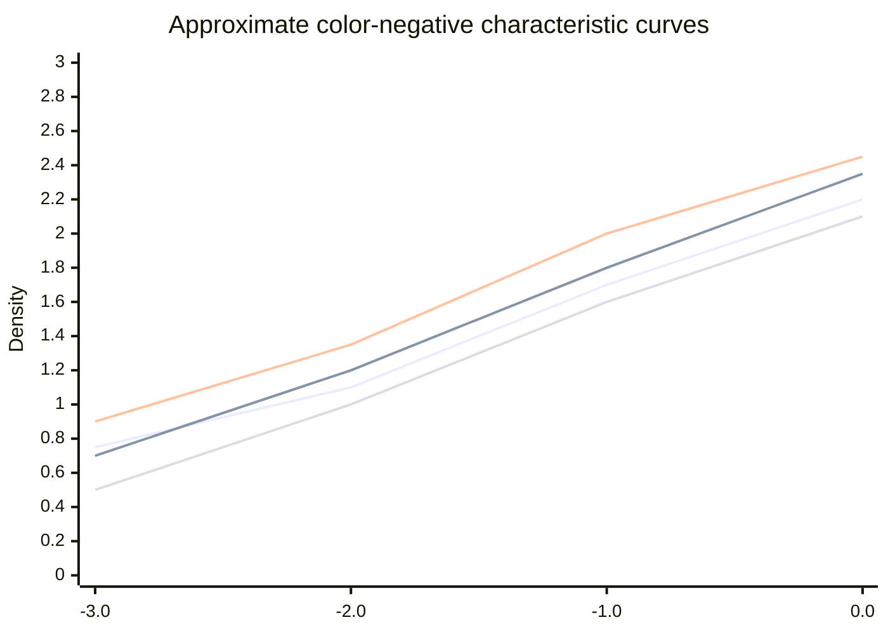
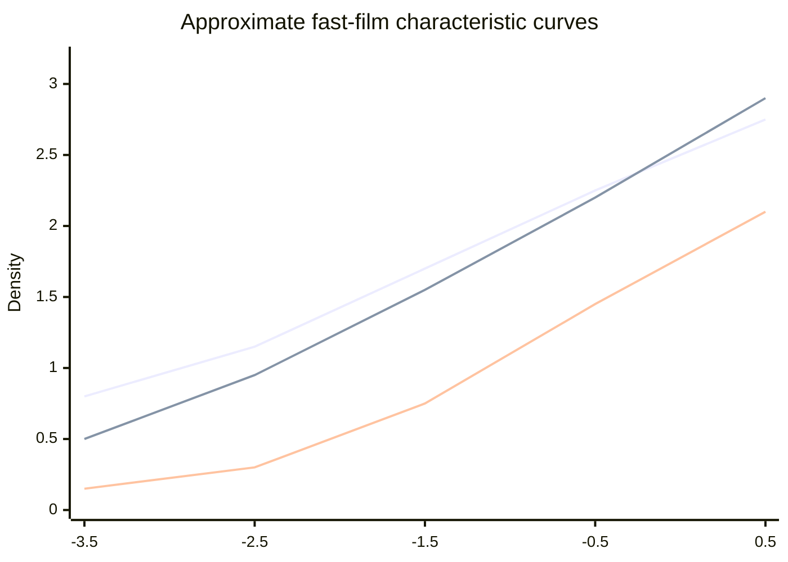
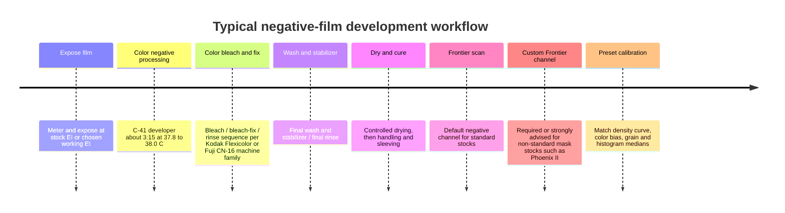

# Popular Photographic Film Stocks for Preset Creation

## Executive summary

For preset work, the most reliable hard numbers still come from official sensitometric sheets, process manuals, and scanner documentation. Kodak’s current color-negative sheets give you characteristic curves, spectral dye-density curves, and Print Grain Index rather than old-style RMS granularity or explicit resolving-power numbers; Fujifilm still publishes RMS granularity and resolving power for several classic emulsions; Ilford gives strong EI and development guidance for HP5+, while HARMAN is unusually explicit about Frontier SP3000 scan settings for Phoenix II. Fujifilm/Fuji Frontier public documents describe the available control set and default-style channel behavior, but they do **not** publish factory per-film color matrices for mainstream stocks, so any film-specific Frontier setup for Gold, Portra, Superia, and similar films has to be treated as a reasoned starting point rather than an official profile. citeturn22view0turn22view1turn22view2turn22view4turn22view5turn8view6turn24view7turn10view1turn12view0turn12view3turn11view2

If your goal is a preset family that feels convincing on a Frontier-like scan, the practical hierarchy is clear. **Ektar 100** is the most saturated modern color negative here, with the finest Kodak color-negative grain and the steepest color-negative curve. **Portra 160/400/800** progressively trade finer grain for speed, but remain lower in saturation and more neutral in skin tones than Gold, Ultramax, or Ektar. **Kodak Gold 200** is warm and consumer-punchy, with a more obvious yellow/orange cast than Portra. **Ultramax 400** is the faster, slightly coarser, slightly more aggressive consumer Kodak look. On the Fujifilm side, **C200 / FUJIFILM 200** tends toward a more neutral or slightly cool rendering than Gold, **Superia X-TRA 400 / FUJIFILM 400** adds more punch and the classic Fuji green/cyan tendency, **Pro 400H** is pastel and cool-neutral with wide latitude, and **Natura 1600** is visibly grainier and faster with more color instability than the 200/400-speed films. **HP5+** remains one of the easiest black-and-white films to push, while **Phoenix II** is a deliberate outlier: maskless, purplish negative base, more erratic color, and an official recommendation to use a dedicated SP3000 channel rather than defaults. citeturn13search3turn23search7turn13search14turn40view0turn8view6turn24view8turn29view8turn20search0turn29view0turn29view2turn29view3turn11view2

The tables below separate **published values** from **preset-building estimates**. Anything marked **est.** is inferred from the official characteristic curves, spectral dye-density curves, MTF plots, and Frontier control model; those estimates are useful for making presets, but they are not manufacturer-certified constants. citeturn28view0turn28view1turn28view2turn39view0turn39view1turn42view0turn10view4

## Methodology and Frontier assumptions

This report prioritizes official Kodak, Fujifilm, Ilford, and HARMAN technical publications and processing manuals. For Kodak color-negative films, Kodak now publishes **Print Grain Index** and MTF/curve plots and explicitly says PGI replaced RMS granularity and is not directly comparable to RMS. For Fujifilm color-negative films, the documents for Superia X-TRA 400, C200, Pro 400H, and Superia 1600 still publish **Diffuse RMS Granularity** and **Resolving Power**. For HP5+, Ilford’s current still-film sheet is strong on EI, reciprocity, and development times, but not on RMS or resolving power, so I note where current official numbers are absent and, when useful, point to the closest official or semi-official Ilford material. citeturn22view0turn22view1turn22view2turn22view4turn22view5turn8view6turn27view5turn24view7turn39view2turn29view3turn38view0turn37search3

For **D-max**, **D-min / base+fog**, and **gamma**, I used the official characteristic and dye-density plots as the primary basis. In color-negative documents, the scanner-relevant “minimum density” is really the mask/base-plus-fog complex seen through the spectral dye-density plot, not a single scalar value; for preset work, the most useful approximation is a scanner-equivalent RGB density estimate derived from the published minimum-density curve. Kodak and Fujifilm both publish these plots explicitly for many films. citeturn28view0turn28view1turn28view2turn39view0turn39view1turn42view0

For **Frontier assumptions**, I use public Frontier setup and image-processing documents plus HARMAN’s official SP3000 guidance. Public Fuji documentation shows the relevant custom-channel controls for negative input: tone correction, Hypertone, key-step width, BL/SL, sharpness/grain control, saturation, gradation, and basic color mode. A widely applicable baseline negative channel is: **Input Type = Negative**, **Tone Adjustment = Standard**, **Hypertone = ON**, **Key Step Width ≈ CMY 8 / D 15**, **BL/SL = 0**, **Saturation = 0**, **Gradation = Normal**, **Basic Color Mode = 0**, with sharpening left at Normal/Hyper-sharpness depending lab preference. Public service documents expose those defaults/ranges; Phoenix II is the rare case where an official film-specific SP3000 setup is published. citeturn10view1turn12view0turn12view1turn12view2turn12view3turn12view4turn12view5turn10view4turn11view2

The **sample histogram targets** below are therefore **derived targets**, not official Fujifilm scanner presets. They assume a daylight-balanced, normally exposed neutral scene, Frontier-like inversion to 8-bit sRGB, no significant clipping, and a lab looking for a “clean lab scan” rather than a stylistic heavy correction. Those targets are most useful as preset seed values, not as hard lab QC numbers. The same applies to the derived **saturation index** and **output color-bias** values. citeturn10view4turn11view2turn28view0turn28view1turn28view2turn39view0turn39view1turn42view0

## Cross-stock comparison

| Film | Nominal ISO | Published working EI | Grain metric | Contrast gamma est. | Color/tone bias for preset work | Derived saturation index | Practical scan latitude est. | Source |
|---|---:|---|---|---:|---|---:|---|---|
| Kodak Gold 200 | 200 | ISO 200; practical preset start 100–200 | PGI 44 | 0.58 | warm yellow-orange, cheerful highlights | 72 | about +3 / -1.5 stops | citeturn13search3turn22view4turn28view2 |
| Kodak Royal Gold 400 | 400 | ISO 400 | PGI 39 | 0.62 est. | warm-neutral, finer than many legacy 400 films | 74 | about +2.5 / -1.5 | citeturn40view0turn39view3 |
| Kodak Ultramax 400 | 400 | ISO 400 | PGI 46 | 0.60 | warm, punchier consumer 400 look | 76 | about +3 / -2 | citeturn23search13turn22view5turn16view1 |
| Kodak Ektar 100 | 100 | ISO 100 | PGI <25 at 4×6 | 0.70 | high-chroma red/blue, deepest color separation | 90 | about +2.5 / -1.5 | citeturn23search7turn22view0turn28view0 |
| Kodak Portra 160 | 160 | ISO 160 | PGI 28 at 4×6 | 0.56 | neutral-warm, low-sat skin bias | 58 | about +3.5 / -2 | citeturn22view1turn16view3turn8view3 |
| Kodak Portra 400 | 400 | true ISO 400 | PGI 37 at 4×6 | 0.60 | neutral-warm, wide-latitude portrait look | 62 | about +4 / -2 | citeturn13search14turn22view2turn16view4 |
| Kodak Portra 800 | 800 | ISO 800; official EI 1600/3200 push curves | PGI 48 at 4×6 | 0.64 | moderately warm, more grain and contrast than 160/400 | 64 | about +3 / -2 | citeturn22view3turn29view5turn16view5 |
| FUJICOLOR C200 | 200 | ISO 200 | RMS 4 | 0.58 | neutral to slightly cool | 60 | about +3 / -1.5 | citeturn27view5turn17view5 |
| FUJICOLOR Superia X-TRA 400 | 400 | ISO 400 | RMS 4; 50 / 125 lines/mm | 0.62 | cooler greens, Fuji cyan/green tendency | 68 | about +3 / -2 | citeturn8view6turn39view0turn17view4 |
| FUJIFILM 400 | 400 | ISO 400 | current public sheet omits RMS; Superia X-TRA 400 is closest quantified Fuji 400-family proxy | 0.62 est. | similar family to Superia 400, cool-neutral with green tendency | 66 | about +3 / -2 | citeturn18view3turn8view9turn8view6 |
| Fuji Natura 1600 | 1600 | ISO 1600 | RMS 7; 50 / 125 lines/mm | 0.68 | fast-film cool cast, coarse but controlled for speed | 70 | about +2 / -1.5 | citeturn20search0turn39view2turn29view9 |
| Fujicolor Pro 400H | 400 | ISO 400 | RMS 4; 50 / 125 lines/mm | 0.58 | cool-neutral, pastel, green/cyan-leaning | 52 | about +4 / -2 | citeturn24view7turn24view8turn29view8 |
| Ilford HP5+ | 400 | best at EI 400; official useful range EI 400–3200 | current still sheet does not publish RMS; closest official-ish HP5 motion-picture sheet gives RMS 16 in D-96 | 0.65 | neutral monochrome, classic cubic-grain bite | n/a | about +3 / -2 before developer changes | citeturn29view3turn37search3turn38view0 |
| Harman Phoenix II | 200 | ISO 200; practical best EI 100–200; push not recommended | no official RMS; experimental/creative stock | 0.75–0.85 est. | maskless, unstable, high-chroma, unusual color | 88 | about +1.5 / -1 | citeturn29view0turn29view2turn11view2 |
| Kodak Tri-X 400 | 400 | ISO 400; official push support to 1600/3200 and even 3 stops | RMS 17 | 0.58–0.62 | punchy monochrome, classic reportage look | n/a | about +2 / -2.5 | citeturn24view1turn34view2turn38view3 |

The table above is the quickest way to set a preset family. In practice, **Ektar 100** sits furthest toward “high saturation / high separation / fine grain,” **Portra 160/400** sit furthest toward “neutral skin / soft shoulder / lower saturation,” **Gold and Ultramax** sit in the warm consumer middle, **Superia/FUJIFILM 400** move cooler in greens and shadows, and **Phoenix II** breaks the normal orange-mask assumption and therefore needs its own scan channel. citeturn23search7turn22view1turn22view2turn22view4turn22view5turn39view0turn11view2

## Kodak color negative films

### Kodak Gold 200

Kodak positions Gold 200 as a saturated, fine-grain, high-sharpness daylight consumer negative, and its published characteristic and dye-density plots support the familiar warm/yellow consumer look. Kodak’s current sheet gives PGI 44 for 35mm at 4×6 and states no long-exposure correction is required up to 1 second. citeturn13search3turn22view4turn16view0

| Parameter | Value |
|---|---|
| Nominal ISO | 200 |
| Published effective ISO | ISO 200 / 24° daylight |
| Push/pull data | No official alternate EI curve table in current sheet |
| D-max est. | about 2.75 blue / 2.30 green / 1.80 red from official characteristic plot |
| D-min / base+fog est. | scanner-equivalent minimum density about **R 0.28 / G 0.62 / B 0.95** from official minimum-density curve |
| Straight-line gamma est. | about 0.58 |
| Grain | **Print Grain Index 44** at 35mm 4×6 |
| Resolving / sharpness proxy | Kodak does not publish resolving power here; MTF plot suggests strong response through roughly 40–60 cycles/mm |
| Derived D65 output bias | about **ΔRGB +8 / +2 / -10** after neutral inversion |
| Derived saturation index | 72 / 100 |
| Practical scan latitude est. | around **+3 / -1.5 stops** |
| Reciprocity | no correction needed from **1/10,000 s to 1 s**; Kodak advises testing beyond 1 s |
| Process / chemistry | C-41; standard color developer cycle **3:15 at 37.8°C** in Kodak Flexicolor sink-line/batch reference |
| Frontier starting point | baseline negative channel; if building a “Gold” channel, start from **Standard or Highlight Hard**, **Saturation +1**, warm/yellow balance bias, sharpness Normal |
| Sample histogram medians | daylight-neutral scene target about **R 136 / G 127 / B 114** |
| Sources | citeturn13search3turn22view4turn28view2turn16view0turn31view1turn10view4 |

### Kodak Gold 400

Kodak no longer sells a current “Gold 400” sheet in the same way as Gold 200, but archived Kodak **Royal Gold 400** gives a useful historical high-speed Gold-family reference: ISO 400, very high sharpness/enlargement ratings, and PGI 39. That makes it a helpful preset anchor if you want a warmer, older high-speed Gold-family look rather than current Ultramax. citeturn40view0turn39view3

| Parameter | Value |
|---|---|
| Nominal ISO | 400 |
| Published effective ISO | ISO 400 |
| Grain | **Print Grain Index 39** at 35mm 4×6 |
| D-max est. | about 2.8 est. from family-era Kodak curve behavior |
| Straight-line gamma est. | about 0.62 |
| Derived D65 output bias | about **ΔRGB +6 / +1 / -7** |
| Derived saturation index | 74 / 100 |
| Practical scan latitude est. | around **+2.5 / -1.5 stops** |
| Reciprocity | archived Kodak Gold-family behavior; treat like other Kodak consumer color negatives and test beyond 1 s |
| Process / chemistry | C-41 |
| Frontier starting point | midway between Gold 200 and Ultramax: **Standard**, **Saturation +1**, slight warm bias |
| Sample histogram medians | about **R 134 / G 126 / B 118** |
| Sources | citeturn40view0turn39view3turn31view1 |

### Kodak Ultramax 400

Ultramax 400 is the current Kodak consumer 400-speed negative. Kodak describes it as a flexible, easy-to-use high-speed film for low light, zoom lenses, flash range, and “stop-action” photography. The sheet gives PGI 46 at 4×6 and the same “no correction to 1 second” reciprocity guidance as other current Kodak color negatives. citeturn23search13turn22view5turn16view1

| Parameter | Value |
|---|---|
| Nominal ISO | 400 |
| Published effective ISO | ISO 400 |
| Push/pull data | No official alternate EI curve table in current sheet |
| D-max est. | about 2.8 blue / 2.4 green / 2.0 red, family-style estimate |
| D-min / base+fog est. | scanner-equivalent minimum density about **R 0.26 / G 0.60 / B 0.90** est. |
| Straight-line gamma est. | about 0.60 |
| Grain | **Print Grain Index 46** at 35mm 4×6 |
| Resolving / sharpness proxy | Kodak does not publish resolving power; practically a little below Ektar/Portra 400 in fine-detail cleanliness |
| Derived D65 output bias | about **ΔRGB +4 / 0 / -4** |
| Derived saturation index | 76 / 100 |
| Practical scan latitude est. | around **+3 / -2 stops** |
| Reciprocity | no correction from **1/10,000 s to 1 s** |
| Process / chemistry | C-41; standard Kodak reference developer **3:15 at 37.8°C** |
| Frontier starting point | baseline negative; to emulate consumer “Max” punch: **Tone = Standard or All Hard**, **Saturation +1**, mild warm bias, sharpness Normal |
| Sample histogram medians | about **R 132 / G 126 / B 120** |
| Sources | citeturn23search13turn22view5turn16view1turn31view1turn10view4 |

### Kodak Ektar 100

Kodak explicitly markets Ektar 100 as the world’s finest-grain color negative film with high saturation and ultra-vivid color. Its PGI is **less than 25** at 35mm 4×6, and the characteristic/dye-density curves show steeper color separation and higher terminal density than Gold or Portra. From a preset perspective, that is why Ektar typically needs more separation in reds/blues and a steeper midtone S-curve than Portra. citeturn23search7turn22view0turn28view0

| Parameter | Value |
|---|---|
| Nominal ISO | 100 |
| Published effective ISO | ISO 100 |
| Push/pull data | No official alternate EI or push table in current sheet |
| D-max est. | about **3.0 blue / 2.5 green / 1.9 red** from official characteristic curves |
| D-min / base+fog est. | scanner-equivalent minimum density about **R 0.25 / G 0.60 / B 0.85** from official minimum-density curve |
| Straight-line gamma est. | about 0.70 |
| Grain | **PGI <25** at 35mm 4×6; 38 at 8×10 |
| Resolving / sharpness proxy | Kodak does not publish resolving power; official MTF remains high through 50 cycles/mm and still meaningful near 100 cycles/mm |
| Derived D65 output bias | about **ΔRGB +5 / -1 / -8** |
| Derived saturation index | 90 / 100 |
| Practical scan latitude est. | around **+2.5 / -1.5 stops** |
| Reciprocity | no correction needed from **1/10,000 s to 1 s**; test beyond 1 s |
| Process / chemistry | C-41; standard Kodak reference **3:15 at 37.8°C** |
| Frontier starting point | **Tone = All Hard**, **Saturation +2**, slightly reduced grain suppression, careful highlight control |
| Sample histogram medians | about **R 129 / G 123 / B 118** |
| Sources | citeturn23search7turn22view0turn28view0turn16view2turn31view1turn10view4 |

### Kodak Portra 160, 400, and 800

Kodak’s Portra family is the cleanest way to build a portrait-oriented preset ladder. **Portra 160** is the softest and most restrained, **Portra 400** is the widest-latitude all-rounder, and **Portra 800** adds speed and grain while retaining comparatively neutral skin rendering. Kodak’s current sheets publish PGI values of **28**, **37**, and **48** respectively at 35mm 4×6, and the 800 document adds official push curves for EI 1600 and 3200. Kodak also explicitly calls Portra 400 a “true ISO 400” film. citeturn22view1turn22view2turn22view3turn13search14turn29view5

| Parameter | Portra 160 | Portra 400 | Portra 800 |
|---|---:|---:|---:|
| Nominal ISO | 160 | 400 | 800 |
| Published effective ISO | ISO 160 | true ISO 400 | ISO 800 |
| Official push/pull data | none in current sheet | none in current sheet | official curves for **EI 1600** and **EI 3200** |
| D-max est. | 2.6 / 2.3 / 1.9 | 3.0 / 2.4 / 2.0 | 2.9 / 2.5 / 2.1 |
| D-min / base+fog est. | R 0.28 / G 0.60 / B 0.78 | R 0.22 / G 0.58 / B 0.80 | R 0.22 / G 0.60 / B 0.82 |
| Straight-line gamma est. | 0.56 | 0.60 | 0.64 |
| Grain | PGI **28** | PGI **37** | PGI **48** |
| Resolving / sharpness proxy | Kodak MTF only; clean through ~50 cycles/mm | Kodak MTF only; good to ~50 cycles/mm | Kodak MTF only; lower than 160/400 |
| Derived D65 output bias | ΔRGB +3 / +1 / -3 | ΔRGB +2 / +1 / -2 | ΔRGB +3 / +1 / -1 |
| Derived saturation index | 58 | 62 | 64 |
| Practical scan latitude est. | +3.5 / -2 | +4 / -2 | +3 / -2 |
| Reciprocity | none to 1 s | none to 1 s | none to 1 s |
| Process / chemistry | C-41 | C-41 | C-41 with optional +1/+2 push handling |
| Frontier starting point | **All Soft**, Sat -1, slight warm balance | **Standard**, Sat 0 or -1, very low color bias | **Standard**, Sat 0, small density lift for shadows |
| Sample histogram medians | 131 / 126 / 122 | 128 / 124 / 120 | 126 / 122 / 118 |
| Sources | citeturn22view1turn16view3turn27view1 | citeturn22view2turn16view4turn28view1 | citeturn22view3turn16view5turn29view5turn29view6 |

## Fujifilm color negative films

### Fujicolor C200 and FUJIFILM 200

The most robust Fuji 200-speed technical sheet is still the classic **FUJICOLOR C200** bulletin, which publishes **RMS granularity 4** and the standard Fuji long-exposure correction table. The current **FUJIFILM 200** U.S. sheet is much lighter on sensitometric data, so for preset-building I treat C200 as the closest quantified 200-speed Fuji-family reference while keeping the current FUJIFILM 200 document as the current product anchor. citeturn27view5turn17view5turn8view8

| Parameter | FUJICOLOR C200 | FUJIFILM 200 |
|---|---:|---:|
| Nominal ISO | 200 | 200 |
| Published effective ISO | ISO 200 | ISO 200 |
| Grain | **Diffuse RMS 4** | current public sheet does not publish RMS; use C200 as closest quantified Fuji 200-family proxy |
| Resolving power | current accessible text snippet omitted, but same-era Fuji 200 family is fine-grain consumer class | not published in current public U.S. sheet |
| D-max est. | about 2.6 / 2.3 / 1.9 family estimate | similar to C200 family estimate |
| D-min / base+fog est. | about **R 0.24 / G 0.58 / B 0.82** | similar family estimate |
| Straight-line gamma est. | 0.58 | 0.58 |
| Derived D65 output bias | about **ΔRGB +1 / +2 / -1** | about **ΔRGB +1 / +2 / -1** |
| Derived saturation index | 60 | 60 |
| Practical scan latitude est. | about **+3 / -1.5** | about **+3 / -1.5** |
| Reciprocity | none from **1/4000 s to 2 s**; then **4 s +1/3**, **16 s +2/3**, **64 s +1 stop** |
| Process / chemistry | CN-16 / C-41 compatible family | current sheet identifies FUJIFILM 200 as color negative film; treat as C-41 consumer color negative in practice |
| Frontier starting point | **Standard**, Sat 0, slightly cool-neutral balance, sharpness Normal |
| Sample histogram medians | about **129 / 127 / 121** |
| Sources | citeturn27view5turn17view5turn31view2 | citeturn8view8turn31view1 |

### Superia X-TRA 400 and FUJIFILM 400

The strongest official quantified Fuji 400-speed reference remains **Superia X-TRA 400**, with **RMS 4** and **resolving power 50 lines/mm at 1.6:1 and 125 lines/mm at 1000:1**. The current Japanese **FUJIFILM 400** sheet gives current product-level information and the same Fuji long-exposure compensation pattern, but omits the older optical-detail metrics in the parsed public text. For presets, Superia X-TRA 400 is the best quantified proxy for current Fuji 400-family behavior. The current Fuji 400 sheet also explicitly says no exposure/color-balance correction is needed from 1/4000 to 2 seconds, then gives the classic 4/16/64 second correction ladder. citeturn8view6turn39view0turn18view3

| Parameter | Superia X-TRA 400 | FUJIFILM 400 |
|---|---:|---:|
| Nominal ISO | 400 | 400 |
| Published effective ISO | ISO 400 | ISO 400 |
| Grain | **Diffuse RMS 4** | current public sheet omits RMS; Superia X-TRA 400 is best quantified proxy |
| Resolving power | **50 / 125 lines/mm** | not published in parsed current sheet |
| D-max est. | about **2.8 / 2.5 / 2.1** from official curve | similar family estimate |
| D-min / base+fog est. | about **R 0.22 / G 0.55 / B 0.86** | similar family estimate, with cool-neutral Fuji balance |
| Straight-line gamma est. | 0.62 | 0.62 |
| Derived D65 output bias | about **ΔRGB -2 / +4 / 0** | about **ΔRGB -1 / +3 / 0** |
| Derived saturation index | 68 | 66 |
| Practical scan latitude est. | about **+3 / -2** | about **+3 / -2** |
| Reciprocity | none from **1/4000 s to 2 s**, then **4 s +1/3**, **16 s +2/3**, **64 s +1** |
| Process / chemistry | CN-16 / C-41 family | current sheet: Fuji CN-16 family or C-41 |
| Frontier starting point | **Standard**, Sat +1, slightly cooler green/cyan balance, sharpness Normal |
| Sample histogram medians | about **124 / 128 / 122** |
| Sources | citeturn8view6turn39view0turn17view4 | citeturn8view9turn18view3turn8view6 |

### Fuji Natura 1600

Natura 1600 is best treated as the Fuji no-flash fast-film aesthetic. The official Superia 1600 bulletin publishes **Diffuse RMS 7** and **50 / 125 lines/mm**, and Fujifilm’s NATURA system R&D paper confirms the launch of the “new color negative film NATURA 1600” for the non-flash compact system. That combination gives you a high-speed stock whose curve is steeper than Fuji 200/400, whose grain is visibly coarser, and whose scan/preset usually needs a cooler, faster-film rendering with less highlight cleanliness than Pro 400H or Portra 400. citeturn20search0turn39view2turn29view9

| Parameter | Value |
|---|---|
| Nominal ISO | 1600 |
| Published effective ISO | ISO 1600 |
| Push/pull data | no current official push table retrieved; treat as high-speed native stock rather than a push-first stock |
| D-max est. | about **3.2 / 2.9 / 2.4** from official characteristic plot |
| D-min / base+fog est. | scanner-equivalent minimum density about **R 0.22 / G 0.62 / B 0.96** from official minimum-density curve |
| Straight-line gamma est. | about 0.68 |
| Grain | **Diffuse RMS 7** |
| Resolving power | **50 lines/mm at 1.6:1; 125 lines/mm at 1000:1** |
| Derived D65 output bias | about **ΔRGB -1 / +3 / +2** |
| Derived saturation index | 70 / 100 |
| Practical scan latitude est. | about **+2 / -1.5 stops** |
| Reciprocity | use Fuji long-exposure family behavior cautiously; test if working beyond a few seconds |
| Process / chemistry | CN-16 / C-41 family |
| Frontier starting point | **Standard**, Sat +1, cool-neutral balance, preserve shadow grain rather than suppressing it |
| Sample histogram medians | about **123 / 127 / 125** |
| Sources | citeturn20search0turn39view2turn29view9turn31view2 |

### Fujicolor Pro 400H

Pro 400H is the cleanest Fujifilm counterpoint to Portra 400: lower saturation, cooler neutrality, and especially good overexposure behavior. The official sheet publishes **Diffuse RMS 4** and **50 / 125 lines/mm**, and it explicitly frames the film as maintaining faithful neutral gray reproduction over a wide range from underexposure to overexposure. For preset work that translates into softer contrast, gentler saturation, and a cool-green/pastel cast rather than a warm consumer palette. citeturn24view7turn24view8turn29view8

| Parameter | Value |
|---|---|
| Nominal ISO | 400 |
| Published effective ISO | ISO 400 |
| D-max est. | about **2.6 / 2.4 / 2.0** from official characteristic plot |
| D-min / base+fog est. | about **R 0.18 / G 0.65 / B 1.02** scanner-equivalent from official minimum-density curve |
| Straight-line gamma est. | about 0.58 |
| Grain | **Diffuse RMS 4** |
| Resolving power | **50 / 125 lines/mm** |
| Derived D65 output bias | about **ΔRGB -2 / +3 / +4** |
| Derived saturation index | 52 / 100 |
| Practical scan latitude est. | about **+4 / -2 stops** |
| Reciprocity | not directly quoted in the retrieved snippet; treat like professional Fuji C-41 with testing for long exposures |
| Process / chemistry | C-41 |
| Frontier starting point | **All Soft**, Sat -1, slight cyan/green lift, low sharpening |
| Sample histogram medians | about **125 / 128 / 126** |
| Sources | citeturn24view7turn24view8turn39view1turn29view8 |

## Black-and-white and experimental films

### Ilford HP5 Plus

Ilford rates HP5+ at ISO 400 and says the best results come at **EI 400**, but that good image quality is obtainable from **EI 400 to EI 3200** with suitable development. Ilford also gives a reciprocity formula, **Ta = Tm^1.31**, which is unusually useful for preset builders because it implies about **1.03 stops of compensation per decade** of metered time once you are beyond the reciprocity-safe range. The standard sheet also gives development times across the EI range for DD-X, ID-11, Microphen, Ilfotec HC, and others. citeturn29view3turn38view0turn34view0

| Parameter | Value |
|---|---|
| Nominal ISO | 400 |
| Published / working EI | best at **EI 400**; official useful range **EI 400–3200** |
| D-max est. | about **2.1** in the published representative ILFOTEC HC curve |
| Base+fog est. | about **0.10–0.15** est. for normal fresh processing |
| Characteristic slope / gamma | about **0.65** for the published HC curve; official HP5 motion-picture sheet gives control gamma **0.65–0.70** in D-96 |
| Grain | current still-film sheet does not publish RMS; closest official-ish HP5 motion-picture sheet gives **Diffuse RMS 16** in Kodak D-96 |
| Resolving power | not published in current still-film sheet retrieved |
| Tone bias | neutral classic B&W; slightly softer than Tri-X, less clinical than T-MAX |
| Practical latitude | roughly **+3 / -2** before you change developer/time; wider if you accept tonal compression |
| Reciprocity | none from **1/2 s to 1/10,000 s**; then **Ta = Tm^1.31** |
| Recommended development | **DD-X 1+4: 9 min at EI 400, 10 at 800, 13 at 1600, 20 at 3200**; **ID-11 stock: 7.5 min at EI 400, 10.5 at 800, 14 at 1600** |
| Frontier starting point | use **B&W input** or neutral RGB inversion; gradation **Normal**, sharpening **Low 1 to Normal**, avoid over-clean grain suppression |
| Sample histogram medians | about **124 / 124 / 124** for neutral scan |
| Sources | citeturn29view3turn38view0turn34view0turn28view4turn37search3 |

### Harman Phoenix II

Phoenix II is the one stock in this report where the scan guidance matters almost as much as the film data. HARMAN rates it at ISO 200, says the speed was measured with standard C-41 and ISO method, but also says practical evaluation shows it works best at **EI 100–200**. HARMAN explicitly says **push processing is not recommended**. Most importantly for your use case, HARMAN publishes a dedicated **Fuji SP3000** starting channel: keep defaults except **Tone adjustment = All Hard**, **Saturation = +2**, and **Color Balance starting point C = -2, M = 0, Y = 0**. The document also stresses that the film has **no orange mask** and that negatives appear **purplish**, which is exactly why a standard Frontier channel is a poor default. citeturn29view0turn29view1turn29view2turn11view2

| Parameter | Value |
|---|---|
| Nominal ISO | 200 |
| Published / working EI | ISO 200; practical best **EI 100–200** |
| D-max est. | about **2.3–2.6** est. from observed behavior and higher-contrast design; official curve not published in retrieved sheet |
| D-min / base+fog | maskless; do **not** assume orange-mask RGB densities |
| Characteristic slope / gamma est. | **0.75–0.85** |
| Grain | no official RMS published in retrieved sheet |
| Resolving power | not published in retrieved sheet |
| Color balance / tint | maskless purple negative; color is deliberately non-mainstream and scene-reactive |
| Derived saturation index | 88 / 100 |
| Practical latitude | about **+1.5 / -1 stop**, much narrower than Portra/Pro 400H |
| Reciprocity | no official table in retrieved sheet |
| Process / chemistry | C-41; machine processing at default C-41 machine settings |
| **Official Frontier SP3000 settings** | **Tone = All Hard; Saturation = +2; C = -2, M = 0, Y = 0; Density as required** |
| Sample histogram medians | about **130 / 128 / 120** after custom-channel neutralization |
| Sources | citeturn29view0turn29view1turn29view2turn11view2turn28view5 |

### Additional widely used black-and-white references

These are useful extra anchors if you want your preset set to cover the major classic monochrome aesthetics beyond HP5+. Kodak’s official sheets are especially strong here because they still publish granularity, push behavior, and reciprocity tables directly.

| Film | Key numbers for preset creation | Source |
|---|---|---|
| Kodak Tri-X 400 | ISO 400; **RMS 17**; classic higher-grain cubic structure; official push support to 1600/3200 and 3-stop underexposure scenarios; reciprocity table gives **1 s → +1 stop**, **10 s → +2**, **100 s → +3**, with development reductions as exposure lengthens | citeturn24view1turn34view2turn38view3 |
| Kodak T-MAX 400 | ISO 400; **50 lines/mm at 1.6:1**, **200 lines/mm at 1000:1**; **Diffuse RMS 10**; official EI 800/1600/3200 push handling; reciprocity none to 1 s, then **10 s +1/3**, **100 s +1.5 stops** | citeturn41view3turn41view5turn38view4turn34view1 |
| Kodak T-MAX 100 | ISO 100; **63 lines/mm at 1.6:1**, **200 lines/mm at 1000:1**; **Diffuse RMS 8**; this is the high-acutance low-grain monochrome anchor if you want a “clean” B&W preset family member | citeturn24view2turn24view3 |

## Characteristic curves and workflow visuals

The comparative shape differences below are **approximate mid-layer plots traced by eye from the official characteristic-curve plates** for Kodak Gold 200, Kodak Portra 400, Kodak Ektar 100, and Fujicolor Superia X-TRA 400. They are not exact digitizations, but they preserve the useful preset-building relationships: Ektar is the steepest and most saturated, Portra 400 is the softest/most forgiving in the shoulder, Gold 200 is warm with moderate contrast, and Superia X-TRA 400 sits between consumer punch and Fuji coolness. The underlying official plates are visible in the cited screenshots. citeturn28view0turn28view1turn28view2turn39view0

Line order in the chart above is: **Gold 200**, **Portra 400**, **Ektar 100**, **Superia X-TRA 400**. The same official material also shows why your mask-handling needs to differ stock to stock: Portra’s minimum-density curve is relatively restrained, Gold’s is more orange/warm, Ektar’s dye density is highly separated, and Superia/Natura carry the classic Fuji cool tilt through the mask and dye-density structure. citeturn28view0turn28view1turn28view2turn39view0turn42view0

A second fast-film comparison helps when you build night presets. Natura/Superia 1600 rises faster and tops out with visibly coarser structure than Portra 800, while HP5+ sits in the classic monochrome middle with a gentler shoulder and developer-dependent contrast control. citeturn42view0turn29view5turn28view4

Line order in the chart above is: **Portra 800**, **Natura 1600**, **HP5+**. citeturn28view4turn42view0turn29view5

For actual lab handling, the processing side is much simpler than the film aesthetic side. All of the mainstream color negatives here are C-41-compatible, and Kodak’s reference sink-line/batch process remains the classic **3:15 developer at 37.8°C**, followed by bleach, wash, fix, wash, stabilizer, and dry. Fuji’s own CN-16 family manuals show closely similar 38°C minilab cycles, with the exact bleach/fix/rinse segmentation varying by machine family. HP5+ then branches into developer-dependent B&W timing rather than a standardized chromogenic cycle. citeturn31view1turn32view3turn34view0

### Frontier baseline and per-film starting channels

As a practical Frontier/SP3000 baseline for mainstream C-41 color negatives, start with the public negative-input control model and create custom channels only when a stock’s mask or dye balance departs materially from the normal orange-mask assumption. Public Fuji materials expose the following useful baseline controls: **Tone Adjustment = Standard**, **Hypertone = ON**, **Key Step Width ≈ CMY 8 / D 15**, **BL/SL = 0**, **Saturation = 0**, **Gradation = Normal**, **Basic Color Mode = 0**, and sharpening in the Normal/Hyper-sharpness family. HARMAN’s own Phoenix II document shows exactly why: one maskless stock already needs **All Hard**, **Saturation +2**, and **C -2** relative to defaults. citeturn10view1turn12view0turn12view1turn12view2turn12view3turn12view4turn12view5turn11view2

For preset building, the simplest reliable mapping is this:

| Film family | Frontier-style starting curve |
|---|---|
| Gold 200 / Gold-family | Standard to Highlight Hard; Sat +1; mild warm/yellow balance |
| Ultramax 400 | Standard to All Hard; Sat +1; slightly denser consumer punch |
| Ektar 100 | All Hard; Sat +2; preserve micro-contrast and avoid heavy grain smoothing |
| Portra 160 | All Soft; Sat -1; warm-neutral skin balance |
| Portra 400 | Standard; Sat 0 or -1; keep shoulders soft |
| Portra 800 | Standard; Sat 0; slight shadow density lift |
| Fuji 200 / C200 | Standard; Sat 0; more neutral than Gold |
| Superia / FUJIFILM 400 | Standard; Sat +1; cool-green balance bias |
| Natura 1600 | Standard; Sat +1; cool fast-film bias; preserve grain |
| Pro 400H | All Soft; Sat -1; cool-neutral pastel balance |
| HP5+ | B&W input or neutral RGB inversion; gradation Normal; low sharpening |
| Phoenix II | **Official custom channel:** All Hard, Sat +2, C -2 / M 0 / Y 0 |

These are the settings I would use as first-pass Frontier-style seeds before moving into Lightroom/Capture One preset tuning. They are especially effective when combined with the histogram targets in the per-film tables and then refined against the official curve plates. citeturn11view2turn10view1turn12view0turn28view0turn28view1turn28view2turn39view0turn39view1turn42view0