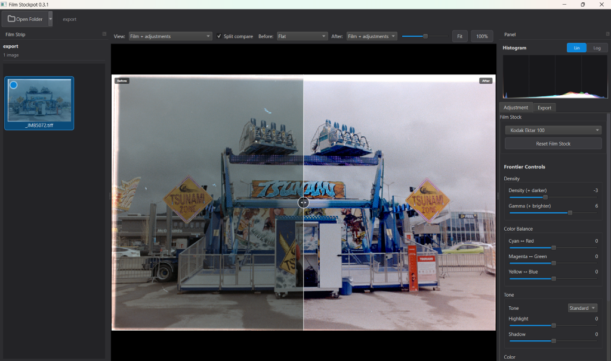

## Screenshot



# Film Stockpot

Film-stock looks and Fuji Frontier–style grading for [NegPy](https://github.com/marcinz606/NegPy) flat 16-bit TIFF exports.

Film Stockpot is a PyQt6 desktop app for exploring **film-stock character** and
**lab-scanner-style operator controls** on exports from
[NegPy](https://github.com/marcinz606/NegPy). NegPy handles negative processing,
scanning, and export; Film Stockpot is an optional companion for grading those
**flat / log 16-bit TIFFs** — applying stock presets, expanding them to full
range for preview, and fine-tuning with Frontier-style density, color, and tone
controls. Edits are non-destructive, saved per image, and can be batch-applied
across a whole roll.

> **Input format:** Film Stockpot expects **flat 16-bit TIFF exports from NegPy**
> — inverted and color-corrected, but intentionally low-contrast ("flat" / "log")
> so the grading pipeline has room to work. It is not aimed at already-finished
> JPEGs or high-contrast positives. See [NegPy → Film Stockpot handoff](#negpy--film-stockpot-handoff) below.

---

## For NegPy users

If you already process negatives in [NegPy](https://github.com/marcinz606/NegPy),
Film Stockpot is built around the same export workflow: finish your NegPy edit,
export a **flat 16-bit TIFF**, then explore film-stock presets and Frontier-style
controls as a separate, non-destructive pass. It is designed to sit **alongside**
NegPy.

| Stage | Tool | Role |
|-------|------|------|
| Scan & negative processing | **[NegPy](https://github.com/marcinz606/NegPy)** | Inversion, normalization, editing, export |
| Film-stock & scanner-style grading | **Film Stockpot** | Optional grading on the flat TIFF export |

Film Stockpot grew out of experiments shared with the NegPy community in
[Show and tell #287](https://github.com/marcinz606/NegPy/discussions/287). NegPy's
flat export made it possible to explore film-stock and scanner-style profiles
without changing the underlying negative work.

**Film Stockpot may interest you if:**

- You export **flat 16-bit TIFFs from NegPy** and want to try different film-stock looks
- You enjoy **Frontier-style** density, CMY balance, and tone controls as a grading pass
- You want **JSON presets** you can edit, share, and version-control

**Film Stockpot focuses on grading** — scanning, inversion, and orange-mask handling
remain NegPy's domain.

---

## Table of contents

- [For NegPy users](#for-negpy-users)
- [Features](#features)
- [How it works](#how-it-works)
- [Requirements](#requirements)
- [Installation](#installation)
- [Usage](#usage)
  - [Preview and compare](#preview-and-compare)
  - [Export naming](#export-naming)
  - [Roll workflow](#roll-workflow)
  - [Command-line export](#command-line-export)
- [Film stock presets](#film-stock-presets)
- [Creating and editing film presets](#creating-and-editing-film-presets)
- [Tuning the Frontier base profile](#tuning-the-frontier-base-profile)
- [Sidecar files](#sidecar-files)
- [Project layout](#project-layout)
- [Development](#development)
- [Versioning](#versioning)
- [Windows release](#windows-release)
- [License](#license)

---

## Features

- **NegPy flat TIFF workflow** — built for **flat / log 16-bit TIFF exports from
  [NegPy](https://github.com/marcinz606/NegPy)**; your export file is never modified.
- **Flat-scan aware pipeline** — expands the flat export to full range for grading,
  then applies film-stock character and operator controls on top.
- **Film-stock emulation** — a library of color and black & white stocks (Kodak
  Portra/Gold/Ektar/Tri-X/T-MAX, Fujicolor, Ilford HP5/Delta 3200, HARMAN Phoenix II, and more).
- **Authentic film character** — per-channel tone-curve crossover, tone-zoned color
  grading, halation bloom, and grain recovered from the scan itself — never
  synthetic noise.
- **Frontier-style operator controls** — density, gamma, CMY color balance, tone
  (Soft → All Hard), highlight/shadow, saturation, and sharpness, all with live
  preview.
- **RGB histogram** — live per-channel histogram with linear or logarithmic display.
- **Pipeline preview stages** — inspect any step of the grading chain: flat scan,
  base graded, film stock only, or film plus Frontier adjustments.
- **Split compare** — drag a before/after divider in the preview to compare two
  pipeline stages side by side (e.g. flat vs. final grade).
- **Interactive preview** — pan, zoom, **Fit**, and **100%** (1:1 pixel) viewing;
  double-click the preview to fit the image to the window.
- **Film-strip browser** — thumbnail strip of every TIFF in a folder, with badges
  for edited and excluded frames.
- **Recent folders** — reopen the last ten export folders from the **Open** menu.
- **Non-destructive editing** — every adjustment is saved to a per-image JSON
  sidecar (similar in spirit to NegPy keeping edits as recipes); your TIFF is
  never modified.
- **Single and batch export** — export the current frame, or render the entire
  roll to 16-bit TIFF, honoring each image's own saved settings.
- **Export naming templates** — built-in filename patterns (or custom tokens) for
  batch exports; the same templates work in the GUI and CLI.
- **Roll settings copy** — copy the current film stock and Frontier adjustments to
  every frame, or only to images that do not yet have a sidecar.
- **Headless CLI** — batch-export folders or single files from the terminal with
  sidecar-aware recipes, progress output, JSON reports, and stable exit codes for
  automation pipelines.
- **Self-contained sidecars** — sidecars embed the full preset and base profile,
  so a TIFF + sidecar renders identically on another machine even if that stock
  isn't installed there.

## How it works

When you open a NegPy flat export, Film Stockpot grades from that pristine TIFF
every time — switching presets never stacks edits.

The processing pipeline is intentionally stateless:

1. **Input transform (base profile)** — expands the flat/log scan to full range via
   auto-levels, per-channel **neutralization** (removes residual scan cast), a
   configurable de-log S-curve, and a brightness gamma.
2. **Film look** — applies the stock's color matrix (or mono mixer for B&W), white
   balance, and **per-channel tone curves** that reproduce R/G/B crossover.
3. **Tone & grade** — tone curve, contrast, lift/gain, gamma, and highlight/shadow
   shaping.
4. **Film character** — tone-zoned **color grading** (split-tone shadows/mids/
   highlights), saturation, **halation** (highlight bloom), and **grain extracted
   from the scan itself** — the only grain in the output is the grain that was
   physically on the film.
5. **Operator adjustments** — your live Frontier-style slider tweaks are applied on
   top, mirroring how a lab operator fine-tunes a scan.

## Requirements

- **Python 3.12+**
- **[uv](https://docs.astral.sh/uv/getting-started/installation/)** for dependency
  management

Core dependencies (installed automatically): `numpy`, `pillow`, `tifffile`,
`imagecodecs`, and `pyqt6`.

## Installation

Clone the repository and sync the environment:

```bash
git clone https://github.com/jboneng/Film-Stockpot.git
cd FilmStockpot
uv sync
```

On first run, `uv` downloads the Python version pinned in `.python-version` if it
isn't already installed.

## Usage

Launch the application:

```bash
uv run film-stockpot
```

Or run it as a module:

```bash
uv run python -m film_stockpot
```

See [RUNNING.md](RUNNING.md) for activating the virtual environment directly and
other command-line details.

### NegPy → Film Stockpot handoff

1. Finish your edit in **NegPy** (exposure, mask handling, retouching, and so on).
2. Export as a **flat 16-bit TIFF** into a folder (the same low-contrast export
   format NegPy uses when you want a neutral starting point for further work).
3. In Film Stockpot, click **Open Folder** and select that export folder.
4. Choose a **Film Stock**, adjust **Frontier Controls**, then export graded
   16-bit TIFFs from the **Export** tab.

Your NegPy export files stay untouched. Film Stockpot stores its own adjustments in
per-image `.stockpot.json` sidecars next to each TIFF.

### Typical workflow (NegPy export → grade → export)

After the [handoff](#negpy--film-stockpot-handoff) above:

1. Pick a frame from the film strip on the left.
2. Choose a **Film Stock** from the dropdown.
3. Fine-tune with the **Frontier Controls** (density, color balance, tone, etc.).
   The preview updates live and your edits are saved automatically.
4. Switch to the **Export** tab and click **Export Image** for the current frame,
   or **Export All** to render the whole roll to 16-bit TIFF.

> Tip: right-click a thumbnail to clear its saved edits or exclude it from batch
> export.

### Preview and compare

Above the main preview, the **View** bar lets you inspect the grading pipeline at
different stages:

| Stage | What you see |
|-------|----------------|
| **Flat** | The raw NegPy flat export |
| **Base graded** | After the shared Frontier base input transform (de-log, neutralize, etc.) |
| **Film stock** | Base graded + film-stock look (no operator sliders) |
| **Film + adjustments** | Full grade including your Frontier Controls |

Enable **Split compare** to show two stages at once with a draggable divider. Pick
**Before** and **After** stages, drag the divider in the preview (or use the
slider), and use **Fit** / **100%** to zoom. Double-click the preview to fit the
image to the window.

### Export naming

On the **Export** tab, the **Naming** section controls how batch exports are
named. Choose a built-in pattern or enter a custom template. Tokens:

| Token | Value |
|-------|--------|
| `{original}` | Source filename (without extension) |
| `{preset}` | Film-stock preset id |
| `{preset_name}` | Film-stock display name |
| `{roll}` | Parent folder name |
| `{n}` / `{n:03}` | Frame index in the batch (optional zero-padding) |
| `{date}` | Export date (`YYYYMMDD`) |

The live example below the template shows what a rendered filename will look like.
Your choice is remembered between sessions. The same tokens apply to CLI batch
export via `--name` (see [Command-line export](#command-line-export)).

Built-in presets include `{original}_export`, `{original}`, `{original}_{preset}`,
and `{roll}_{n:03}_{original}`.

### Roll workflow

When every frame on a roll should share the same look:

1. Grade one representative frame (film stock + Frontier Controls).
2. On the **Export** tab, click **Copy Settings to All** to write sidecars for
   every image, or **Copy to Unedited Only** to leave frames that already have
   their own edits untouched.
3. Fine-tune individual frames if needed, then **Export All**.

Use **Recent folders** under the toolbar **Open** menu to jump back to a roll you
were working on.

### Command-line export

Launch the GUI with no arguments (same from `uv run`, the installed app, or
`FilmStockpot.exe`). Use the `export` subcommand for headless batch rendering:

```powershell
# List preset ids for --stock
film-stockpot presets list

# Folder: per-image sidecars when present, Portra 400 for the rest
film-stockpot export .\negpy-flat\ -o .\graded\ --stock kodak_portra_400

# Single file
film-stockpot export frame.tiff -o frame_graded.tif --stock kodak_gold_200

# Only export from existing sidecars
film-stockpot export .\roll\ -o .\out\ --use-sidecars

# Shared fallback recipe from a sidecar JSON file
film-stockpot export .\roll\ -o .\out\ --sidecar template.tiff.stockpot.json

# Frontier adjustments from JSON; skip files that already exist
film-stockpot export .\roll\ -o .\out\ --stock kodak_portra_400 --adjustments frontier.json

# Overwrite existing outputs
film-stockpot export .\roll\ -o .\out\ --stock kodak_portra_400 --overwrite

# Machine-readable report for scripts and pipelines
film-stockpot export .\roll\ -o .\out\ --stock kodak_portra_400 --json --quiet
```

By default, existing output files are **skipped**. Use `--overwrite` to replace
them. `--stock` is required unless `--use-sidecars` or `--sidecar` supplies the
recipe. Run `film-stockpot export --help` for all options.

#### Tool chains and automation

For pipelines that call Film Stockpot before the next step, use **`--json`** so
**stdout** is a single JSON report and progress stays on **stderr** (unless
`--quiet` suppresses it).

```powershell
film-stockpot export .\negpy-flat\ -o .\graded\ --stock kodak_portra_400 --json --quiet
if ($LASTEXITCODE -ne 0) { exit $LASTEXITCODE }

# Example: pass exported paths to the next tool
$report = film-stockpot export .\negpy-flat\ -o .\graded\ --stock kodak_portra_400 --json --quiet | ConvertFrom-Json
foreach ($path in $report.outputs) { Write-Host "Next step input: $path" }
```

The JSON report includes:

| Field | Purpose |
|-------|---------|
| `status` | `success`, `partial`, `skipped`, `failed`, or `cancelled` |
| `exit_code` / `exit_name` | Same value the process returns |
| `outputs` | Absolute paths ready for the next tool (exported + skipped) |
| `files` | Per-image `source`, `output`, `status`, and optional `error` |
| `counts` | `total`, `exported`, `skipped`, `failed` |
| `errors` / `warnings` | Human-readable messages |

**Exit codes** (stable):

| Code | Name | Meaning |
|------|------|---------|
| `0` | `ok` | All jobs exported or skipped; no failures |
| `1` | `runtime_error` | One or more renders failed, or nothing was produced |
| `2` | `usage_error` | Bad arguments, missing `--stock`, invalid paths |
| `3` | `no_input` | Folder contained no TIFF files |

In shell pipelines, check **`$LASTEXITCODE`** (PowerShell) or **`$?`** / **`$!`**
(bash) before passing `outputs` to the next command.

## Film stock presets

Presets live in the [`FilmPresets/`](FilmPresets) folder as JSON files, organized
by the [`_index.json`](FilmPresets/_index.json) manifest. A shared
[`_frontier_base.json`](FilmPresets/_frontier_base.json) profile is applied beneath
every stock so the Frontier signature is added once rather than baked in twice.

Files beginning with an underscore (`_index.json`, `_frontier_base.json`) are
reserved; every other `.json` file is treated as a film stock. The next two
sections are a complete guide to authoring and tuning them.

## Creating and editing film presets

This section walks through building a new film stock from scratch and tweaking an
existing one. The fastest way to start is to **copy the preset closest to your
target** (e.g. [`kodak_portra_400.json`](FilmPresets/kodak_portra_400.json) for a
soft color stock, or [`kodak_tmax_100.json`](FilmPresets/kodak_tmax_100.json) for
black & white) and edit from there.

### 1. Add the file and register it

1. Create `FilmPresets/my_stock.json`.
2. Give it a unique `id` (used internally and in sidecars) and a display `name`.
3. Add an entry to the appropriate group in
   [`_index.json`](FilmPresets/_index.json):

```json
{
  "family": "kodak_consumer",
  "label": "Kodak consumer",
  "presets": [
    { "id": "my_stock", "name": "My Stock 400", "file": "my_stock.json" }
  ]
}
```

To create a brand-new group, add another object to the `groups` array with its own
`family`, `label`, and `presets` list. The dropdown shows groups in index order,
and presets in the order listed. If `_index.json` is missing entirely, the app
falls back to loading every non-underscore JSON file as one flat group.

> The `id` must be unique. Sidecars are matched back to installed stocks by `id`,
> so changing an `id` later will orphan any existing edits made with the old one.

### 2. Understand which fields actually render

A preset file contains two kinds of fields:

- **Render fields** — read by the processing pipeline and change the image.
- **Metadata fields** — documentation only (datasheet values, notes, confidence).
  They're useful for provenance but have **no effect on the output**.

Everything the renderer reads lives under the top-level `monochrome` flag and the
`pipeline` object. A minimal but complete color preset looks like this:

```json
{
  "schema_version": "1.0",
  "id": "my_stock",
  "name": "My Stock 400",
  "monochrome": false,
  "pipeline": {
    "tone_curve_8bit": [[0, 0], [32, 26], [96, 106], [192, 212], [255, 252]],
    "white_balance": { "rgb_gains": [1.01, 1.0, 0.99] },
    "scanner_adjustments": {
      "highlights": -10,
      "shadows": -2,
      "gamma": 0.98,
      "saturation_pct": 102
    },
    "look": {
      "contrast_pct": 5,
      "lift": -0.01,
      "gain": 1.0,
      "color_matrix": [[1.01, 0.0, -0.01], [0.0, 1.0, 0.0], [-0.01, 0.01, 1.01]],
      "mono_mixer": null
    }
  }
}
```

The other fields you'll see in the shipped presets — `manufacturer`, `type`,
`category`, `film`, `notes`, `confidence`, `native_scanner_profile`, `source`, and
`temp_k`/`tint`/`temp_k_bias`/`local_contrast_pct` — are metadata and are **not**
applied. Keep them for reference, but don't expect them to change the look.

### 3. Render field reference

Stages run in this order, on top of the [Frontier base](#tuning-the-frontier-base-profile)'s
input transform. Color and B&W differ where noted.

| Field | Type | Neutral | What it does |
|-------|------|---------|--------------|
| `monochrome` | bool | `false` | When `true`, converts to grayscale via `look.mono_mixer` and **skips** `color_matrix`, `white_balance`, and saturation. |
| `look.mono_mixer` | `[r, g, b]` | `[0.299, 0.587, 0.114]` | B&W only. RGB → luma weights. Higher G ≈ panchromatic; raise R to lighten skin, raise B to darken skies. |
| `look.color_matrix` | 3×3 | identity | Color only. Multiplies each output channel by a row of weights — the core color cross-talk / hue character. |
| `white_balance.rgb_gains` | `[r, g, b]` | `[1, 1, 1]` | Color only. Per-channel multiplier. `>1` warms/brightens that channel. |
| `tone_curve_8bit` | list of `[x, y]` | `[[0,0],[255,255]]` | Tone mapping in 0–255 space (interpolated). Lift the toe to fade shadows, pull the shoulder to roll off highlights. |
| `look.contrast_pct` | number (%) | `0` | S-contrast around mid-grey. `+` increases contrast, `-` flattens. |
| `look.lift` | number | `0.0` | Adds a constant (raises/lowers the black point). Small values, e.g. `-0.02`. |
| `look.gain` | number | `1.0` | Multiplies the whole image (overall exposure). |
| `scanner_adjustments.gamma` | number | `1.0` | Midtone gamma. `>1` brightens midtones, `<1` darkens. |
| `scanner_adjustments.highlights` | number (%) | `0` | `+` lifts highlights, `-` compresses them. |
| `scanner_adjustments.shadows` | number (%) | `0` | `+` lifts shadows, `-` deepens them. |
| `scanner_adjustments.saturation_pct` | number (%) | `100` | Color only. `100` = unchanged, `120` = +20% saturation, `0` = grayscale. |

> Grain is **not** synthesized. The only grain in the output is the film's own
> grain, recovered from the scan by `grain_extraction` (see below). The `grain`
> block in the shipped presets (`metric`, `value`) is datasheet metadata only.

Notes:

- **Tone curve** points are `[input, output]` from 0 to 255 and are linearly
  interpolated, then normalized internally to 0–1. The first/last points set the
  black/white endpoints.
- **Color matrix** is applied as `out = image @ matrix.T`. Start from the identity
  matrix and nudge off-diagonal terms by `±0.01`–`0.03` to shift hues subtly.
- For **B&W presets**, set `monochrome: true`, provide a `mono_mixer`, set
  `color_matrix: null`, and `saturation_pct` is ignored (the image is already
  gray). See [`ilford_hp5_plus.json`](FilmPresets/ilford_hp5_plus.json).

### 4. Film-character fields (optional, advanced)

These reproduce the parts of a film look that simple global controls can't —
tone-dependent color, channel crossover, halation, and real grain. All are
optional; omit a block and that stage is skipped. **Halation and grain extraction
also have global defaults in the [Frontier base](#tuning-the-frontier-base-profile)**,
so a preset only needs these blocks to *override* the base behavior.

| Field | Type | What it does |
|-------|------|--------------|
| `tone_curves_rgb` | `{ "r": [...], "g": [...], "b": [...] }` | Per-channel tone curves (same `[x, y]` 0–255 format). The R/G/B difference creates **color crossover** — e.g. cool shadows + warm highlights. Color presets only. |
| `color_grading.shadows` / `.midtones` / `.highlights` | `[r, g, b]` offsets | **Split-tone** color: adds a different tint to each tonal zone (luma-weighted). Tiny values, e.g. `0.005`–`0.012`. Color presets only. |
| `halation.intensity` | number | Strength of the highlight bloom (`0` disables). |
| `halation.threshold` | number `0`–`1` | Luma above which highlights bloom. |
| `halation.radius` | number | Bloom size; resolution-independent (scaled to image size). |
| `halation.color` | `[r, g, b]` | Bloom tint (classic film red/orange ≈ `[1.0, 0.32, 0.1]`). Forced neutral for B&W. |
| `grain_extraction.strength` | number | Amount of the scan's **real** high-frequency grain to lift out and re-apply (monochromatic, midtone-weighted). |
| `grain_extraction.radius` | number (px) | High-pass size used to isolate grain (`1` keeps the finest detail). |

Example block inside `pipeline` (see
[`kodak_portra_400.json`](FilmPresets/kodak_portra_400.json) for a live one):

```json
"tone_curves_rgb": {
  "r": [[0, 2], [128, 132], [255, 254]],
  "g": [[0, 0], [128, 128], [255, 255]],
  "b": [[0, 6], [128, 124], [255, 246]]
},
"color_grading": {
  "shadows":    [-0.004, 0.0,   0.006],
  "midtones":   [ 0.006, 0.002, -0.004],
  "highlights": [ 0.012, 0.006, -0.01]
},
"halation":        { "intensity": 0.15, "threshold": 0.7, "radius": 12, "color": [1.0, 0.3, 0.1] },
"grain_extraction": { "strength": 0.4, "radius": 1 }
```

> `grain_extraction` recovers each stock's **own** grain from the flat scan. This
> is the only grain source — no synthetic grain is ever added.

### 5. Iterate

There's no build step. Edit the JSON, save, and **restart the app** (presets are
loaded once at startup). Pick your stock from the dropdown to see the result. Work
in small increments — a `±5` change to `contrast_pct` or `±0.02` to a matrix term
is usually visible.

If a preset fails to load (invalid JSON, wrong types), the app shows a "Presets
Unavailable" warning and the dropdown falls back to just **None**. Re-check the
file with a JSON validator if that happens.

## Tuning the Frontier base profile

[`_frontier_base.json`](FilmPresets/_frontier_base.json) is the shared layer applied
**beneath every film stock**. Its job is to take NegPy's flat/log 16-bit TIFF and
expand it back to a normal-looking, full-range image *before* any film look is
applied. Get this right once and every preset benefits; get it wrong and every
preset will look washed out or crushed.

> **Important:** only the `input_transform` and `look_defaults` blocks are read by
> the renderer. The other blocks in this file (`frontier_defaults`, `base_look`,
> `confidence`, `source`) are documentation and have **no effect** on the output.

### The `input_transform` block

```json
"input_transform": {
  "auto_levels": true,
  "per_channel": false,
  "black_clip_pct": 0.1,
  "white_clip_pct": 0.1,
  "neutralize": true,
  "neutralize_strength": 0.4,
  "delog_strength": 0.1,
  "gamma": 1.25
}
```

Stages run top to bottom:

| Field | Type | What it does | Tuning guidance |
|-------|------|--------------|-----------------|
| `auto_levels` | bool | Stretches the real black/white points back to full range. | Leave `true` for flat scans; set `false` only if your scans are already full-range. |
| `per_channel` | bool | When `true`, auto-levels each RGB channel independently (removes color casts but can shift white balance). When `false`, uses a shared luma range (preserves color). | Keep `false` for NegPy exports unless you specifically want aggressive per-channel neutralization. |
| `black_clip_pct` | number (%) | Percentile of darkest pixels clipped to black. | Higher = deeper, contrastier blacks. Lower = lifted/brighter shadows. Typical `0.05`–`0.5`. |
| `white_clip_pct` | number (%) | Percentile of brightest pixels clipped to white. | Higher = brighter highlights (more pixels pushed to white). Typical `0.05`–`0.5`. |
| `neutralize` | bool | Aligns the per-channel medians toward a common grey, stripping residual scan cast so every stock starts from a consistent neutral anchor. | Leave `true` for consistent color across a roll; set `false` to preserve the scan's own cast. |
| `neutralize_strength` | number `0`–`1` | How strongly to neutralize (`0` = off, `1` = fully equalize channel medians). | `0.3`–`0.5` removes cast without flattening intentional color. |
| `delog_strength` | number `0`–`1` | Blends in an S-curve to restore contrast lost in the flat scan. | More = punchier but darker below mid-grey. If images come out too dark/contrasty, **lower this first**. |
| `gamma` | number | Main exposure/brightness dial applied after de-log. | `>1` brightens midtones, `<1` darkens. This is the knob to reach for if everything is too dark or too bright. |

### The `look_defaults` block

`look_defaults` carries film characteristics applied to **every** stock unless a
preset overrides them. Today it holds the default **halation** and **grain
extraction** settings (same fields documented in
[Film-character fields](#creating-and-editing-film-presets)):

```json
"look_defaults": {
  "halation":        { "intensity": 0.12, "threshold": 0.72, "radius": 10, "color": [1.0, 0.32, 0.1] },
  "grain_extraction": { "strength": 0.35, "radius": 1 }
}
```

A preset that defines its own `halation` or `grain_extraction` under `pipeline`
takes precedence over these defaults for that stock.

### Recommended tuning order

1. **Brightness too dark/light overall?** Adjust `gamma` (e.g. `1.25` → `1.4` to
   brighten).
2. **Too flat or too contrasty?** Adjust `delog_strength` (lower to flatten/lighten
   shadows, raise for more punch).
3. **Blacks not black / highlights not white?** Nudge `black_clip_pct` and
   `white_clip_pct` (small steps — these clip real data).
4. **Color cast across the whole roll?** Raise `neutralize_strength` (or, more
   aggressively, set `per_channel: true` and re-check your stocks afterward).
5. **Halation/grain too strong globally?** Lower the `look_defaults` values.

Changes here affect **all** presets, so tune against a few representative frames
(a high-key shot, a low-key shot, and a neutral mid-tone one) and restart the app
to apply. If you only want to change one stock's look, edit that preset's
`scanner_adjustments`/`look` instead of the base.

## Sidecar files

Edits are stored next to each image as a sidecar:

```
my_scan.tiff            ← your original (never modified)
my_scan.tiff.stockpot.json   ← saved edit state
```

The sidecar embeds the schema version, the full film-stock preset, the full base
profile, and your operator adjustments. Deleting the sidecar (or clearing it from
the right-click menu) restores the image to its default flat state.

## Project layout

```
FilmStockpot/
├── FilmPresets/              # Film-stock preset JSON + index + base profile
├── docs/                     # Screenshots and other documentation assets
├── installer/                # Inno Setup script for the Windows installer
├── packaging/                # PyInstaller spec and build assets
├── scripts/                  # Version bump, Windows build, and release scripts
├── src/film_stockpot/
│   ├── app.py                # Application entry point
│   ├── cli.py                # Headless export and presets subcommands
│   ├── export_engine.py      # Shared batch export logic (GUI + CLI)
│   ├── export_naming.py      # Export filename templates
│   ├── sidecar.py            # Per-image edit sidecar read/write
│   ├── image/
│   │   ├── io.py             # Load/save 16-bit TIFF ↔ float32 RGB
│   │   ├── tiff_loader.py    # TIFF → QImage for display
│   │   ├── pipeline.py       # Film-stock emulation pipeline
│   │   ├── scanner.py        # Frontier-style operator adjustments
│   │   └── folder.py         # TIFF discovery
│   ├── presets/loader.py     # Preset and base-profile loading
│   └── ui/                   # PyQt6 main window, panels, widgets, workers
│       ├── preview_stages.py # Pipeline stage labels and preview helpers
│       ├── recent_folders.py # Recently opened folder persistence
│       └── widgets/          # Film strip, viewer, export panel, etc.
└── tests/                    # Pytest suite
```

## Development

Install with development tools (pytest):

```bash
uv sync --dev
```

Run the test suite:

```bash
uv run pytest
```

Add a dependency:

```bash
uv add <package>          # runtime
uv add --dev <package>    # development
```

## Versioning

Film Stockpot uses **major.minor.build** (starting at **0.1.1**). The version is
kept in sync in `pyproject.toml`, `src/film_stockpot/__init__.py`, and the
`film-stockpot` entry in `uv.lock`.

| Event | What changes |
|-------|----------------|
| Push to `main` | Build number increments (`0.1.1` → `0.1.2`) |
| `release_windows.ps1` after a release | Minor increments, build resets to 1 (`0.1.5` → `0.2.1`) for the next dev cycle |
| Manual (`--major`) | Major increments, minor and build reset (`0.2.3` → `1.0.1`) |

The version in `pyproject.toml` and `src/film_stockpot/__init__.py` is the single
source of truth. It is shown in the app window title, embedded in the installer
filename (`FilmStockPot_x64_<version>.exe`), and used for the GitHub release tag
(`v<version>`).

When you change the version manually, commit `pyproject.toml`, `__init__.py`, and
`uv.lock` together so they stay aligned.

Automation commits use `[skip ci]` so they do not re-trigger the build bump.
Version-pin and post-release commits from the release script include `[skip ci]`
for the same reason.

Bump the major version manually when needed:

```bash
uv run python scripts/bump_version.py --major
```

Set an exact version:

```bash
uv run python scripts/bump_version.py --set 0.1.1
```

## Windows release

Film Stockpot ships as a standalone Windows x64 installer named
`FilmStockPot_x64_<version>.exe`. The `<version>` is always the same value shown in
the app title bar and stored in `pyproject.toml`.

### One-command release (recommended)

Prerequisites:

- [uv](https://docs.astral.sh/uv/)
- [Inno Setup 6](https://jrsoftware.org/isinfo.php)
- [GitHub CLI](https://cli.github.com/) (`gh auth login`)
- Branch `main`, clean working tree (no uncommitted changes)
- Version you want to ship already committed on `main`

Install GitHub CLI on Windows:

```powershell
winget install --id GitHub.cli -e
```

After installing, **open a new terminal** so `gh` is on your `PATH`, then run:

```powershell
gh auth login
```

### Before you release

The release script ships whatever version is currently in `pyproject.toml` — it
does **not** choose the version for you. Pushes to `main` also trigger a CI job
that bumps the **build** number (e.g. `0.1.3` → `0.1.4`).

Typical flow to ship `0.1.3`:

1. Set the version and commit with `[skip ci]` so CI does not bump it again:

   ```powershell
   uv run python scripts/bump_version.py --set 0.1.3
   git add pyproject.toml src/film_stockpot/__init__.py uv.lock
   git commit -m "chore: set release version to 0.1.3 [skip ci]"
   git push origin main
   ```

2. Confirm the version is still `0.1.3`:

   ```powershell
   uv run python scripts/bump_version.py --print
   ```

3. Run the release script (see below). After a successful release, `main` moves to
   the next minor dev version (e.g. `0.2.1`).

From the project root:

```powershell
.\scripts\release_windows.cmd
```

If PowerShell blocks unsigned scripts on your machine, use the `.cmd` wrapper above
(it runs the script with `-ExecutionPolicy Bypass` for that invocation only). You
can also run:

```powershell
powershell -NoProfile -ExecutionPolicy Bypass -File .\scripts\release_windows.ps1
```

This script automatically:

1. Verifies `pyproject.toml` and `__init__.py` versions match (app display version)
2. Builds `dist/installer/FilmStockPot_x64_<version>.exe`
3. Tags the current commit as `v<version>` and pushes the tag
4. Creates a GitHub release with the installer attached
5. Bumps the minor version for the next development cycle and pushes `main`

Options:

- `-SkipBump` — publish the release without bumping to the next minor version
- `-Draft` — create a draft GitHub release instead of publishing immediately

### Build installer only

To build without publishing:

```powershell
.\scripts\build_windows.cmd
```

Output:

- `dist/FilmStockpot/FilmStockpot.exe` — standalone app folder (PyInstaller)
- `dist/installer/FilmStockPot_x64_<version>.exe` — Windows installer

Use `-SkipInstaller` to build only the PyInstaller bundle.

### Release from GitHub Actions

The **Release Windows** workflow (Actions → **Release Windows** → **Run workflow**)
runs the same `release_windows.ps1` script on a Windows runner if you prefer not
to build locally. It uses the repository `GITHUB_TOKEN` to create tags and releases.

Use the workflow inputs to create a draft release or skip the post-release minor
bump. The same version rules apply: commit the version you want to ship on `main`
before triggering the workflow, and use `[skip ci]` on version-pin commits so CI
does not bump the build number first.

Local release is usually simpler for a first release or when debugging the build.

## License

Film Stockpot is licensed under the [GNU General Public License v3.0](LICENSE.txt).